***
[[TOC]]
> 该文章转载自 (https://paddlepedia.readthedocs.io/)
# 卷积（Convolution）

## 一、卷积提出背景

在全连接网络<sup>[1]</sup>中，一张图片上的所有像素点会被展开成一个1维向量输入网络，如 **图1** 所示，28 x 28的输入数据被展开成为784 x 1 的数据作为输入。

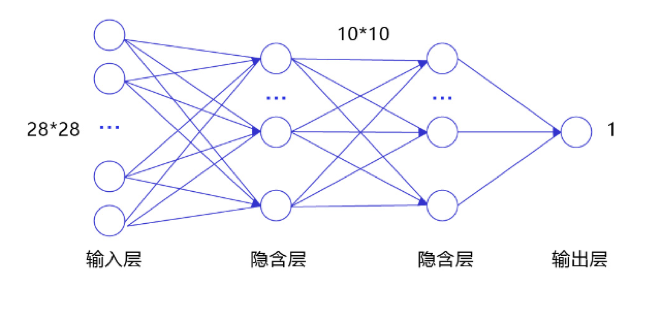

图1 全连接网络图

这样往往会存在如下两个问题：

**1. 输入数据的空间信息被丢失。** 空间上相邻的像素点往往具有相似的RGB值，RGB的各个通道之间的数据通常密切相关，但是转化成1维向量时，这些信息被丢失。如 **图2** 所示，空间位置相邻的两个点A和B，转化成1维向量后并没有体现出他们之间的空间关联性。

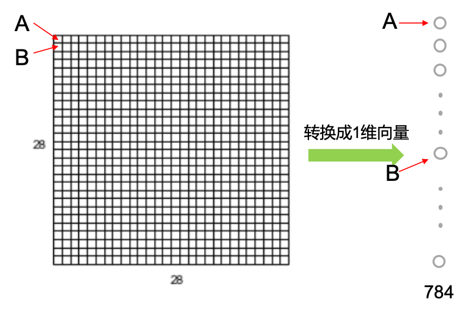

图2 图片转换为1维向量

**2. 模型参数过多，容易发生过拟合。** 由于每个像素点都要跟所有输出的神经元相连接。当图片尺寸变大时，输入神经元的个数会按图片尺寸的平方增大，导致模型参数过多，容易发生过拟合。例如：对于一幅$1000\times 1000$ 的输入图像而言，如果下一个隐含层的神经元数目为$10^6$ 个，那么将会有$1000\times 1000\times 10^6=10^{12}$ 个权重参数，可以想象，如此大规模的参数量使得网络很难训练。

为了解决上述问题，引入卷积（Convolution）来对输入的图像进行特征提取。卷积的计算范围是在像素点的空间邻域内进行的，因此可以利用输入图像的空间信息；此外，由于卷积具有局部连接、权重共享等特性，卷积核参数的数目也远小于全连接层。

## 二、卷积核 / 特征图 / 卷积计算 

**卷积核（kernel）**：也被叫做滤波器（filter），假设卷积核的高和宽分别为$k_h$和$k_w$，则将称为$k_h\times k_w$卷积，比如$3\times5$卷积，就是指卷积核的高为3, 宽为5。卷积核中数值为对图像中与卷积核同样大小的子块像素点进行卷积计算时所采用的权重。

**卷积计算（convolution）**：图像中像素点具有很强的空间依赖性，卷积（convolution）就是针对像素点的空间依赖性来对图像进行处理的一种技术。

**特征图（feature map）**：卷积滤波结果在卷积神经网络中被称为特征图（feature map）。


### 应用示例

在卷积神经网络中，卷积层的实现方式实际上是数学中定义的互相关 （cross-correlation）运算，具体的计算过程如 **图3** 所示，每张图的左图表示输入数据是一个维度为3 x 3的二维数组；中间的图表示卷积核是一个维度为2 x 2的二维数组。

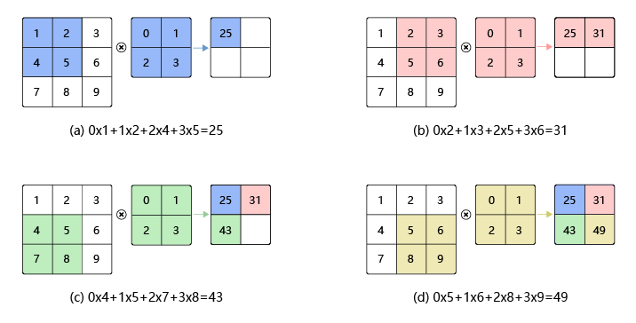

图3 卷积计算过程


- 如图3（a）所示：左边的图大小是$3\times3$，表示输入数据是一个维度为$3\times3$的二维数组；中间的图大小是$2\times2$，表示一个维度为$2\times2$的二维数组，我们将这个二维数组称为卷积核。先将卷积核的左上角与输入数据的左上角（即：输入数据的(0, 0)位置）对齐，把卷积核的每个元素跟其位置对应的输入数据中的元素相乘，再把所有乘积相加，得到卷积输出的第一个结果：

$$0\times1 + 1\times2 + 2\times4 + 3\times5 = 25  \ \ \ \ \ \ \ (a)$$

- 如图3（b）所示：将卷积核向右滑动，让卷积核左上角与输入数据中的(0,1)位置对齐，同样将卷积核的每个元素跟其位置对应的输入数据中的元素相乘，再把这4个乘积相加，得到卷积输出的第二个结果：

$$0\times2 + 1\times3 + 2\times5 + 3\times6 = 31  \ \ \ \ \ \ \ (b)$$

- 如图3（c）所示：将卷积核向下滑动，让卷积核左上角与输入数据中的(1, 0)位置对齐，可以计算得到卷积输出的第三个结果：

$$0\times4 + 1\times5 + 2\times7 + 3\times8 = 43   \ \ \ \ \ \ \ (c)$$

- 如图3（d）所示：将卷积核向右滑动，让卷积核左上角与输入数据中的(1, 1)位置对齐，可以计算得到卷积输出的第四个结果：

$$0\times5 + 1\times6 + 2\times8 + 3\times9 = 49   \ \ \ \ \ \ \ (d)$$

最终可以得到图3（d）右侧所示的特征图。


卷积核的计算过程可以用下面的数学公式表示，其中 $a$ 代表输入图片， $b$ 代表输出特征图，$w$ 是卷积核参数，它们都是二维数组，$\sum{u,v}{\ }$ 表示对卷积核参数进行遍历并求和。

$$b[i, j] = \sum_{u,v}{a[i+u, j+v]\cdot w[u, v]}$$

举例说明，假如上图中卷积核大小是$2\times 2$，则$u$可以取0和1，$v$也可以取0和1，也就是说：

$$b[i, j] = a[i+0, j+0]\cdot w[0, 0] + a[i+0, j+1]\cdot w[0, 1] + a[i+1, j+0]\cdot w[1, 0] + a[i+1, j+1]\cdot w[1, 1]$$

读者可以自行验证，当$[i, j]$取不同值时，根据此公式计算的结果与上图中的例子是否一致。


------
**思考：**

为了能够更好地拟合数据，在卷积神经网络中，一个卷积算子除了上面描述的卷积过程之外，还包括加上偏置项的操作。例如假设偏置为1，则上面卷积计算的结果为：

$$0\times1 + 1\times2 + 2\times4 + 3\times5 \mathbf{\  + 1}  = 26$$
$$0\times2 + 1\times3 + 2\times5 + 3\times6 \mathbf{\  + 1} = 32$$
$$0\times4 + 1\times5 + 2\times7 + 3\times8 \mathbf{\  + 1} = 44$$
$$0\times5 + 1\times6 + 2\times8 + 3\times9 \mathbf{\  + 1} = 50$$

------

**说明：**

1. 输入图像的边缘像素因其处于边缘位置，因此无法参与卷积计算；
2. 图像卷积计算实质上是对图像进行了下采样 (down sampling)操作。对卷积得到的图像结果不断卷积滤波，则原始图像就会被“层层抽象、层层约减”，从而使得蕴涵在图像中的重要信息“显山露水”；
3. 卷积核中的权重系数$w_i$是通过数据驱动机制学习得到，其用来捕获图像中某像素点及其邻域像素点所构成的特有空间模式。一旦从数据中学习得到权重系数，这些权重系数就刻画了图像中像素点构成的空间分布不同模式。

##  三、填充（Padding）

输入图像边缘位置的像素点无法进行卷积滤波，为了使边缘像素也参与卷积滤波，填充技术应运而生。填充是指在边缘像素点周围填充“0”（即0填充），使得输入图像的边缘像素也可以参与卷积计算。注意，在这种填充机制下，卷积后的图像分辨率将与卷积前图像分辨率一致，不存在下采样。

### 应用示例

在上面的例子中，输入图片尺寸为$3\times3$，输出图片尺寸为$2\times2$，经过一次卷积之后，图片尺寸变小。卷积输出特征图的尺寸计算方法如下（卷积核的高和宽分别为$k_h$和$k_w$）：

$$H_{out} = H - k_h + 1$$
$$W_{out} = W - k_w + 1$$

如果输入尺寸为4，卷积核大小为3时，输出尺寸为$4-3+1=2$。读者可以自行检查当输入图片和卷积核为其他尺寸时，上述计算式是否成立。当卷积核尺寸大于1时，输出特征图的尺寸会小于输入图片尺寸。如果经过多次卷积，输出图片尺寸会不断减小。为了避免卷积之后图片尺寸变小，通常会在图片的外围进行填充(padding)，如 **图4** 所示。

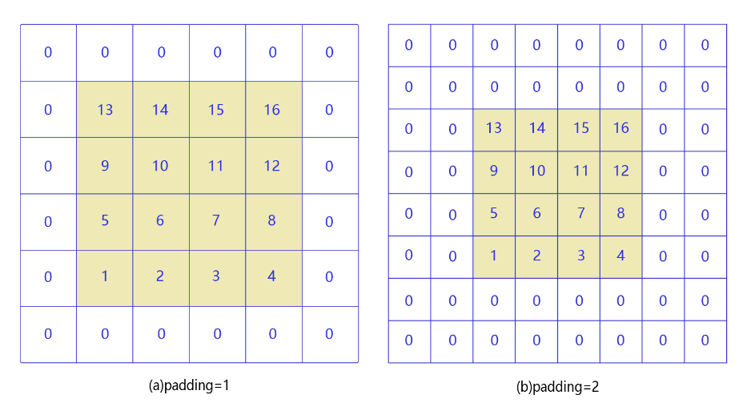

图4 图形填充

- 如图4（a）所示：填充的大小为1，填充值为0。填充之后，输入图片尺寸从$4\times4$变成了$6\times6$，使用$3\times3$的卷积核，输出图片尺寸为$4\times4$。

- 如图4（b）所示：填充的大小为2，填充值为0。填充之后，输入图片尺寸从$4\times4$变成了$8\times8$，使用$3\times3$的卷积核，输出图片尺寸为$6\times6$。

如果在输入图片第一行之前填充$p_{h1}$行，在最后一行之后填充$p_{h2}$行；在图片第1列之前填充$p_{w1}$列，在最后1列之后填充$p_{w2}$列；则填充之后的图片尺寸为$(H + p_{h1} + p_{h2})\times(W + p_{w1} + p_{w2})$。经过大小为$k_h\times k_w$的卷积核操作之后，输出图片的尺寸为：

$$H_{out} = H + p_{h1} + p_{h2} - k_h + 1$$

$$W_{out} = W + p_{w1} + p_{w2} - k_w + 1$$

在卷积计算过程中，通常会在高度或者宽度的两侧采取等量填充，即$p_{h1} = p_{h2} = p_h,\ \ p_{w1} = p_{w2} = p_w$，上面计算公式也就变为：

$$H_{out} = H + 2p_h - k_h + 1$$

$$W_{out} = W + 2p_w - k_w + 1$$
为了便于padding，卷积核大小通常使用1，3，5，7这样的奇数，这样如果使用的填充大小为$p_h=(k_h-1)/2 ，p_w=(k_w-1)/2$，则可以使得卷积之后图像尺寸不变。例如当卷积核大小为3时，padding大小为1，卷积之后图像尺寸不变；同理，如果卷积核大小为5，padding大小为2，也能保持图像尺寸不变。

## 四、步长（Stride）

在卷积操作时，通常希望输出图像分辨率与输入图像分辨率相比会逐渐减少，即图像被约减。因此，可以通过改变卷积核在输入图像中移动步长大小来跳过一些像素，进行卷积滤波。当Stride=1时，卷积核滑动跳过1个像素，这是最基本的单步滑动，也是标准的卷积模式。Stride=k表示卷积核移动跳过的步长是k。

### 应用示例

**图3** 中卷积核每次滑动一个像素点，这是步长为1的情况。**图5** 是步长为2的卷积过程，卷积核在图片上移动时，每次移动大小为2个像素点。

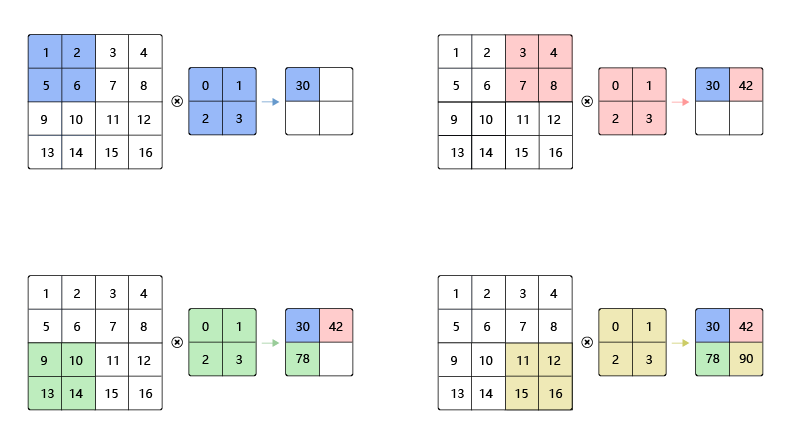

图5 步幅为2的卷积过程

当高和宽方向的步幅分别为$s_h$和$s_w$时，输出特征图尺寸的计算公式是：

$$H_{out} = \frac{H + 2p_h - k_h}{s_h} + 1$$

$$W_{out} = \frac{W + 2p_w - k_w}{s_w} + 1$$

---

**思考：**

假设输入图片尺寸是$H\times W = 100 \times 100$，卷积核大小$k_h \times k_w = 3 \times 3$，填充$p_h = p_w = 1$，步长为$s_h = s_w = 2$，则输出特征图的尺寸为：

$$H_{out} = \frac{100 + 2 - 3}{2} + 1 = 50$$

$$W_{out} = \frac{100 + 2 - 3}{2} + 1 = 50$$

---

## 五、感受野（Receptive Field）

卷积所得结果中，每个特征图像素点取值依赖于输入图像中的某个区域，该区域被称为感受野（receptive field），正所谓“管中窥豹、见微知著”。那么这个区域在哪呢，在卷积神经网络中，感受野是特征图（feature map）上的点对应输入图像上的区域。感受野内每个元素数值的变动，都会影响输出点的数值变化。

### 应用示例

比如$3\times3$卷积对应的感受野大小就是$3\times3$，如 **图6** 所示。

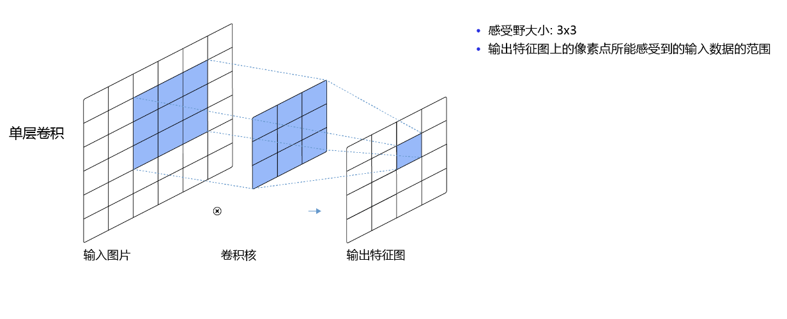

图6 感受野为3×3的卷积

而当通过两层$3\times3$的卷积之后，感受野的大小将会增加到$5\times5$，如 **图7** 所示。

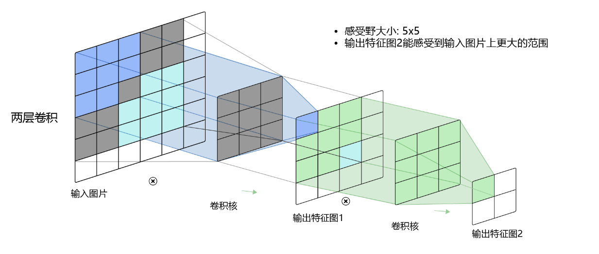

图7 感受野为5×5的卷积

因此，当增加卷积网络深度的同时，感受野将会增大，输出特征图中的一个像素点将会包含更多的图像语义信息。

## 六、多输入通道、多输出通道和批量操作

前面介绍的卷积计算过程比较简单，实际应用时，处理的问题要复杂的多。例如：对于彩色图片有RGB三个通道，需要处理多输入通道的场景，相应的输出特征图往往也会具有多个通道。而且在神经网络的计算中常常是把一个批次的样本放在一起计算，所以卷积算子需要具有批量处理多输入和多输出通道数据的功能。

### 多输入通道场景

当输入含有多个通道时，对应的卷积核也应该有相同的通道数。假设输入图片的通道数为$C_{in}$，输入数据的形状是$C_{in}\times{H_{in}}\times{W_{in}}$。

1. 对每个通道分别设计一个2维数组作为卷积核，卷积核数组的形状是$C_{in}\times{k_h}\times{k_w}$。
1. 对任一通道$C_{in} \in [0, C_{in})$，分别用大小为$k_h\times{k_w}$的卷积核在大小为$H_{in}\times{W_{in}}$的二维数组上做卷积。
1. 将这$C_{in}$个通道的计算结果相加，得到的是一个形状为$H_{out}\times{W_{out}}$的二维数组。

### 应用示例

上面的例子中，卷积层的数据是一个2维数组，但实际上一张图片往往含有RGB三个通道，要计算卷积的输出结果，卷积核的形式也会发生变化。假设输入图片的通道数为$3$，输入数据的形状是$3\times{H_{in}}\times{W_{in}}$，计算过程如 **图8** 所示。

1. 对每个通道分别设计一个2维数组作为卷积核，卷积核数组的形状是$3\times{k_h}\times{k_w}$。
1. 对任一通道$c_{in} \in [0, 3)$，分别用大小为$k_h\times{k_w}$的卷积核在大小为$H_{in}\times{W_{in}}$的二维数组上做卷积。
1. 将这$3$个通道的计算结果相加，得到的是一个形状为$H_{out}\times{W_{out}}$的二维数组。

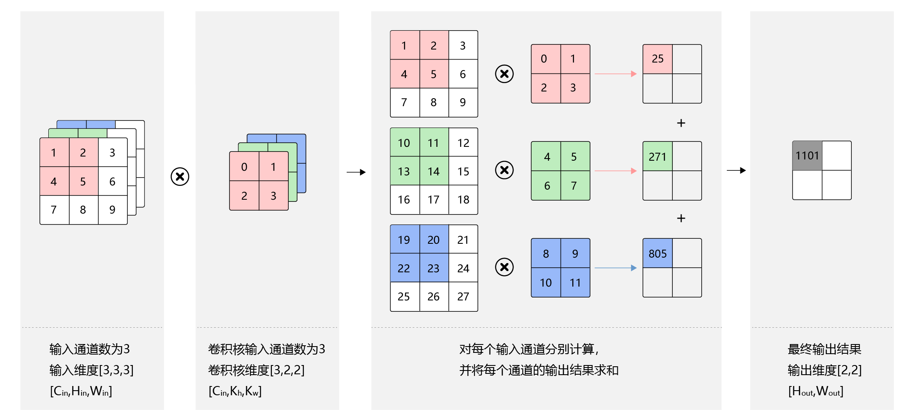

图8 多输入通道计算过程

### 多输出通道场景

如果我们希望检测多种类型的特征，实际上我们可以使用多个卷积核进行计算。所以一般来说，卷积操作的输出特征图也会具有多个通道$C_{out}$，这时我们需要设计$C_{out}$个维度为$C_{in}\times{k_h}\times{k_w}$的卷积核，卷积核数组的维度是$C_{out}\times C_{in}\times{k_h}\times{k_w}$。

1. 对任一输出通道$c_{out} \in [0, C_{out})$，分别使用上面描述的形状为$C_{in}\times{k_h}\times{k_w}$的卷积核对输入图片做卷积。
1. 将这$C_{out}$个形状为$H_{out}\times{W_{out}}$的二维数组拼接在一起，形成维度为$C_{out}\times{H_{out}}\times{W_{out}}$的三维数组。

### 应用示例

假设输入图片的通道数为3，我们希望检测2种类型的特征，这时我们需要设计$2$个维度为$3\times{k_h}\times{k_w}$的卷积核，卷积核数组的维度是$2\times 3\times{k_h}\times{k_w}$，如 **图9** 所示。

1. 对任一输出通道$c_{out} \in [0, 2)$，分别使用上面描述的形状为$3\times{k_h}\times{k_w}$的卷积核对输入图片做卷积。

1. 将这$2$个形状为$H_{out}\times{W_{out}}$的二维数组拼接在一起，形成维度为$2\times{H_{out}}\times{W_{out}}$的三维数组。


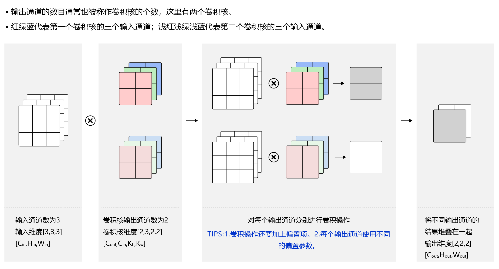

图9 多输出通道计算过程

### 批量操作

在卷积神经网络的计算中，通常将多个样本放在一起形成一个mini-batch进行批量操作，即输入数据的维度是$N\times{C_{in}}\times{H_{in}}\times{W_{in}}$。由于会对每张图片使用同样的卷积核进行卷积操作，卷积核的维度是$C_{out}\times C_{in}\times{k_h}\times{k_w}$，那么，输出特征图的维度就是$N\times{C_{out}}\times{H_{out}}\times{W_{out}}$。

### 应用示例

假设我们输入数据的维度是$2\times{3}\times{H_{in}}\times{W_{in}}$，卷积核的维度与上面多输出通道的情况一样，仍然是$2\times 3\times{k_h}\times{k_w}$，输出特征图的维度是$2\times{2}\times{H_{out}}\times{W_{out}}$。如 **图10** 所示。

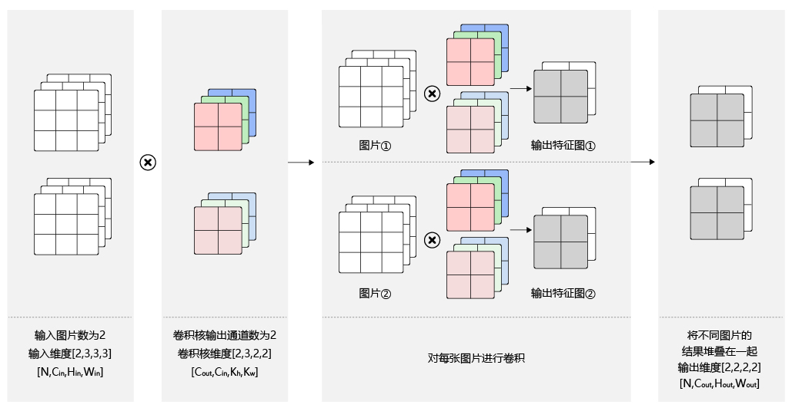

图10 批量操作

## 七、卷积优势

- **保留空间信息**

在卷积运算中，计算范围是在像素点的空间邻域内进行的，它代表了对空间邻域内某种特征模式的提取。对比全连接层将输入展开成一维的计算方式，卷积运算可以有效学习到输入数据的空间信息。

- **局部连接**

在上文中，我们介绍了感受野的概念，可以想像，在卷积操作中，每个神经元只与局部的一块区域进行连接。对于二维图像，局部像素关联性较强，这种局部连接保证了训练后的滤波器能够对局部特征有最强的响应，使神经网络可以提取数据的局部特征。全连接与局部连接的对比如 **图11** 所示。

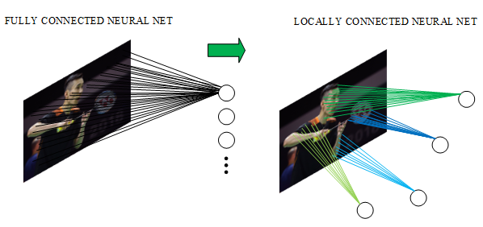

图11 全连接与局部连接

同时，由于使用了局部连接，隐含层的每个神经元仅与部分图像相连，考虑本文开篇提到的例子，对于一幅$1000\times 1000$ 的输入图像而言，下一个隐含层的神经元数目同样为$10^6$ 个，假设每个神经元只与大小为$10\times 10$ 的局部区域相连，那么此时的权重参数量仅为$10\times 10\times 10^6=10^{8}$ ，相交密集链接的全连接层少了4个数量级。

- **权重共享**

卷积计算实际上是使用一组卷积核在图片上进行滑动，计算乘加和。因此，对于同一个卷积核的计算过程而言，在与图像计算的过程中，它的权重是共享的。这其实就大大降低了网络的训练难度， **图12** 为权重共享的示意图。这里还使用上边的例子，对于一幅$1000\times 1000$ 的输入图像，下一个隐含层的神经元数目为$10^6$ 个，隐含层中的每个神经元与大小为$10\times 10$ 的局部区域相连，因此有$10\times 10$ 个权重参数。将这$10\times 10$ 个权重参数共享给其他位置对应的神经元，也就是$10^6$ 个神经元的权重参数保持一致，那么最终需要训练的参数就只有这$10\times 10$个权重参数了。

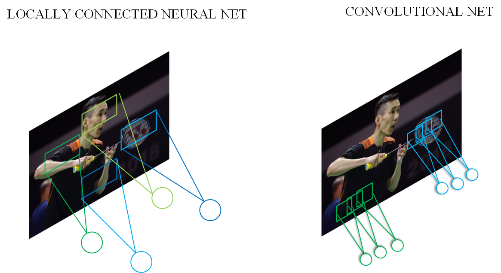

图12 权重共享示意图

- **不同层级卷积提取不同特征**

在CNN网络中，通常使用多层卷积进行堆叠，从而达到提取不同类型特征的作用。比如:浅层卷积提取的是图像中的边缘等信息；中层卷积提取的是图像中的局部信息；深层卷积提取的则是图像中的全局信息。这样，通过加深网络层数，CNN就可以有效地学习到图像从细节到全局的所有特征了。对一个简单的5层CNN进行特征图可视化后的结果如 **图13**所示 ^[1]^。

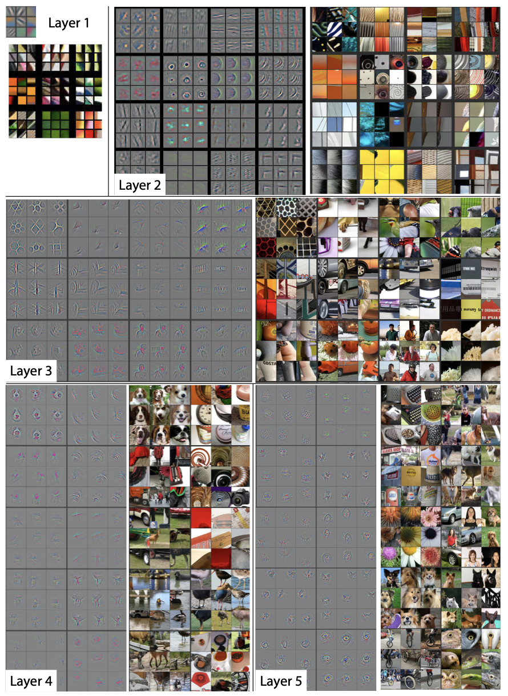

图13 特征图可视化示意图

通过上图可以看到，Layer1和Layer2种，网络学到的基本上是边缘、颜色等底层特征；Layer3开始变的稍微复杂，学习到的是纹理特征；Layer4中，学习到了更高维的特征，比如：狗头、鸡脚等；Layer5则学习到了更加具有辨识性的全局特征。

## 八、卷积应用示例

### 案例1：简单的黑白边界检测

下面是使用Conv2D算子完成一个图像边界检测的任务。图像左边为光亮部分，右边为黑暗部分，如 **图14** 所示，需要检测出光亮跟黑暗的分界处。

设置宽度方向的卷积核为$[1, 0, -1]$，如 **图15** 所示。此卷积核会将宽度方向间隔为1的两个像素点的数值相减。当卷积核在图片上滑动时，如果它所覆盖的像素点位于亮度相同的区域，则左右间隔为1的两个像素点数值的差为0。只有当卷积核覆盖的像素点有的处于光亮区域，有的处在黑暗区域时，左右间隔为1的两个点像素值的差才不为0。将此卷积核作用到图片上，输出特征图上只有对应黑白分界线的地方像素值才不为0。具体代码如下所示，输出图像如 **图16** 所示。

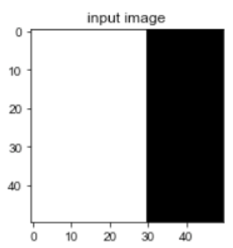

图14 输入图像

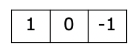

图15 卷积核


```python
import matplotlib.pyplot as plt
import numpy as np
import paddle
from paddle.nn import Conv2D
from paddle.nn.initializer import Assign
%matplotlib inline

# 创建初始化权重参数w
w = np.array([1, 0, -1], dtype='float32')
# 将权重参数调整成维度为[cout, cin, kh, kw]的四维张量
w = w.reshape([1, 1, 1, 3])
# 创建卷积算子，设置输出通道数，卷积核大小，和初始化权重参数
# kernel_size = [1, 3]表示kh = 1, kw=3
# 创建卷积算子的时候，通过参数属性weight_attr指定参数初始化方式
# 这里的初始化方式时，从numpy.ndarray初始化卷积参数
conv = Conv2D(in_channels=1, out_channels=1, kernel_size=[1, 3],
       weight_attr=paddle.ParamAttr(
          initializer=Assign(value=w)))

# 创建输入图片，图片左边的像素点取值为1，右边的像素点取值为0
img = np.ones([50,50], dtype='float32')
img[:, 30:] = 0.
# 将图片形状调整为[N, C, H, W]的形式
x = img.reshape([1,1,50,50])
# 将numpy.ndarray转化成paddle中的tensor
x = paddle.to_tensor(x)
# 使用卷积算子作用在输入图片上
y = conv(x)
# 将输出tensor转化为numpy.ndarray
out = y.numpy()
f = plt.subplot(121)
f.set_title('input image', fontsize=15)
plt.imshow(img, cmap='gray')
f = plt.subplot(122)
f.set_title('output featuremap', fontsize=15)
# 卷积算子Conv2D输出数据形状为[N, C, H, W]形式
# 此处N, C=1，输出数据形状为[1, 1, H, W]，是4维数组
# 但是画图函数plt.imshow画灰度图时，只接受2维数组
# 通过numpy.squeeze函数将大小为1的维度消除
plt.imshow(out.squeeze(), cmap='gray')
plt.show()
```


```python
# 查看卷积层的权重参数名字和数值
print(conv.weight)
# 参看卷积层的偏置参数名字和数值
print(conv.bias)
```

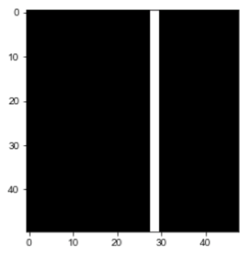

图16 输出图像

### 案例2：图像中物体边缘检测

上面展示的是一个人为构造出来的简单图片，使用卷积网络检测图片明暗分界处的示例。对于真实的图片，如 **图17** 所示，也可以使用合适的卷积核，如 **图18** 所示。(3 x 3卷积核的中间值是8，周围一圈的值是8个-1)对其进行操作，用来检测物体的外形轮廓，观察输出特征图跟原图之间的对应关系，如下代码所示，输出图像如 **图19** 所示。

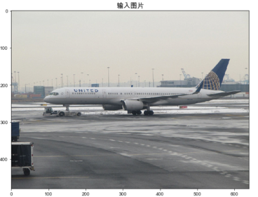

图17 输入图像


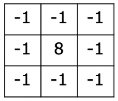

图18 卷积核


```python
import matplotlib.pyplot as plt
from PIL import Image
import numpy as np
import paddle
from paddle.nn import Conv2D
from paddle.nn.initializer import Assign
img = Image.open('./img/example1.jpg')

# 设置卷积核参数
w = np.array([[-1,-1,-1], [-1,8,-1], [-1,-1,-1]], dtype='float32')/8
w = w.reshape([1, 1, 3, 3])
# 由于输入通道数是3，将卷积核的形状从[1,1,3,3]调整为[1,3,3,3]
w = np.repeat(w, 3, axis=1)
# 创建卷积算子，输出通道数为1，卷积核大小为3x3，
# 并使用上面的设置好的数值作为卷积核权重的初始化参数
conv = Conv2D(in_channels=3, out_channels=1, kernel_size=[3, 3], 
            weight_attr=paddle.ParamAttr(
              initializer=Assign(value=w)))
    
# 将读入的图片转化为float32类型的numpy.ndarray
x = np.array(img).astype('float32')
# 图片读入成ndarry时，形状是[H, W, 3]，
# 将通道这一维度调整到最前面
x = np.transpose(x, (2,0,1))
# 将数据形状调整为[N, C, H, W]格式
x = x.reshape(1, 3, img.height, img.width)
x = paddle.to_tensor(x)
y = conv(x)
out = y.numpy()
plt.figure(figsize=(20, 10))
f = plt.subplot(121)
f.set_title('input image', fontsize=15)
plt.imshow(img)
f = plt.subplot(122)
f.set_title('output feature map', fontsize=15)
plt.imshow(out.squeeze(), cmap='gray')
plt.show()
```

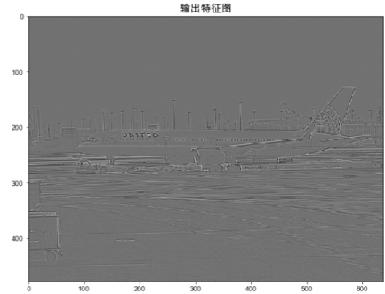

图19 输出图像

### 案例3：图像均值模糊

对一张输入图像如 **图20** 所示，另外一种比较常见的卷积核，如 **图21** 所示。（5\*5的卷积核中每个值均为1）是用当前像素跟它邻域内的像素取平均，这样可以使图像上噪声比较大的点变得更平滑，如下代码所示，输出图像如 **图22** 所示。


图20 输入图像

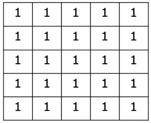

图21 卷积核


```python
import paddle
import matplotlib.pyplot as plt
from PIL import Image
import numpy as np
from paddle.nn import Conv2D
from paddle.nn.initializer import Assign
# 读入图片并转成numpy.ndarray
# 换成灰度图
img = Image.open('./img/example2.jpg').convert('L')
img = np.array(img)

# 创建初始化参数
w = np.ones([1, 1, 5, 5], dtype = 'float32')/25
conv = Conv2D(in_channels=1, out_channels=1, kernel_size=[5, 5], 
        weight_attr=paddle.ParamAttr(
         initializer=Assign(value=w)))
x = img.astype('float32')
x = x.reshape(1,1,img.shape[0], img.shape[1])
x = paddle.to_tensor(x)
y = conv(x)
out = y.numpy()

plt.figure(figsize=(20, 12))
f = plt.subplot(121)
f.set_title('input image')
plt.imshow(img, cmap='gray')

f = plt.subplot(122)
f.set_title('output feature map')
out = out.squeeze()
plt.imshow(out, cmap='gray')

plt.show()
```


图22 输出图像

## 参考文献

[1] [Visualizing and Understanding Convolutional Networks](https://arxiv.org/pdf/1311.2901.pdf)


## 一、1*1 卷积

$1\times{1}$ 卷积，与标准卷积完全一样，唯一的特殊点在于卷积核的尺寸是$1\times{1}$ ，也就是不去考虑输入数据局部信息之间的关系，而把关注点放在不同通道间。当输入矩阵的尺寸为$3\times{3}$ ，通道数也为3时，使用4个$1\times{1}$卷积核进行卷积计算，最终就会得到与输入矩阵尺寸相同，通道数为4的输出矩阵，如 **图1** 所示。

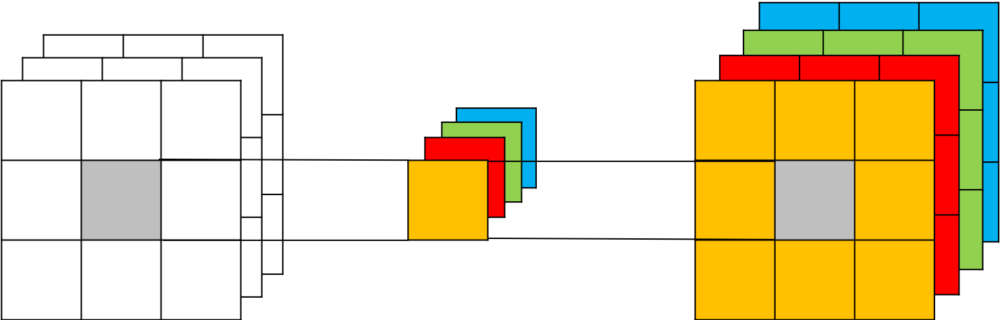

图1 1*1 卷积结构示意图

- **$1\times{1}$ 卷积的作用**

1. 实现信息的跨通道交互与整合。考虑到卷积运算的输入输出都是3个维度（宽、高、多通道），所以$1\times{1}$ 卷积实际上就是对每个像素点，在不同的通道上进行线性组合，从而整合不同通道的信息。
2. 对卷积核通道数进行降维和升维，减少参数量。经过$1\times{1}$ 卷积后的输出保留了输入数据的原有平面结构，通过调控通道数，从而完成升维或降维的作用。
3. 利用$1\times{1}$ 卷积后的非线性激活函数，在保持特征图尺寸不变的前提下，大幅增加非线性

## 二、应用示例

- **$1\times{1}$ 卷积在GoogLeNet<sup>[1]</sup>中的应用**

GoogLeNet是2014年ImageNet比赛的冠军，它的主要特点是网络不仅有深度，还在横向上具有“宽度”。由于图像信息在空间尺寸上的巨大差异，如何选择合适的卷积核来提取特征就显得比较困难了。空间分布范围更广的图像信息适合用较大的卷积核来提取其特征；而空间分布范围较小的图像信息则适合用较小的卷积核来提取其特征。为了解决这个问题，GoogLeNet提出了一种被称为Inception模块的方案。如 **图2** 所示：

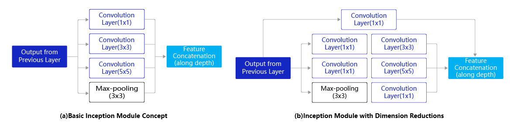

图2 Inception模块结构示意图

Inception模块的设计思想采用多通路(multi-path)的设计形式，每个支路使用不同大小的卷积核，最终输出特征图的通道数是每个支路输出通道数的总和。如 **图2(a)** 所示，Inception模块使用3个不同大小的卷积核对输入图片进行卷积操作，并附加最大池化，将这4个操作的输出沿着通道维度进行拼接，构成的输出特征图将会包含经过不同大小的卷积核提取出来的特征，从而达到捕捉不同尺度信息的效果。然而，这将会导致输出通道数变得很大，尤其是将多个Inception模块串联操作的时候，模型参数量会变得非常大。

为了减小参数量，Inception模块改进了设计方式。如 **图2(b)** 所示，在$3\times{3}$ 和$5\times{5}$ 的卷积层之前均增加$1\times{1}$ 的卷积层来控制输出通道数；在最大池化层后面增加$1\times{1}$ 卷积层减小输出通道数。下面这段程序是Inception块的具体实现方式，可以对照 **图2(b)** 和代码一起阅读。

我们这里可以简单计算一下Inception模块中使用$1\times{1}$ 卷积前后参数量的变化，这里以 **图2(a)** 为例，输入通道数 $C_{in}=192$，$1\times{1}$ 卷积的输出通道数$C_{out1}=64$，$3\times{3}$ 卷积的输出通道数$C_{out2}=128$，$5\times{5}$ 卷积的输出通道数$C_{out3}=32$，则 **图2(a)** 中的结构所需的参数量为：


$$
1\times1\times192\times64+3\times3\times192\times128+5\times5\times192\times32=387072
$$
**图2(b)** 中在$3\times{3}$ 卷积前增加了通道数$C_{out4}=96$ 的 $1\times{1}$ 卷积，在$5\times{5}$ 卷积前增加了通道数$C_{out5}=16$ 的 $1\times{1}$ 卷积，同时在maxpooling后增加了通道数$C_{out6}=32$ 的 $1\times{1}$ 卷积，参数量变为：

$$
\begin{eqnarray}\small{
1\times1\times192\times64+1\times1\times192\times96+1\times1\times192\times16+3\times3\times96\times128+5\times5\times16\times32 \\
+1\times1\times192\times32 =163328}
\end{eqnarray}
$$
可见，$1\times{1}$ 卷积可以在不改变模型表达能力的前提下，大大减少所使用的参数量。

Inception模块的具体实现如下代码所示：


```python
# GoogLeNet模型代码
import numpy as np
import paddle
from paddle.nn import Conv2D, MaxPool2D, AdaptiveAvgPool2D, Linear
## 组网
import paddle.nn.functional as F

# 定义Inception块
class Inception(paddle.nn.Layer):
    def __init__(self, c0, c1, c2, c3, c4, **kwargs):
        '''
        Inception模块的实现代码，
        
        c1,图(b)中第一条支路1x1卷积的输出通道数，数据类型是整数
        c2,图(b)中第二条支路卷积的输出通道数，数据类型是tuple或list, 
               其中c2[0]是1x1卷积的输出通道数，c2[1]是3x3
        c3,图(b)中第三条支路卷积的输出通道数，数据类型是tuple或list, 
               其中c3[0]是1x1卷积的输出通道数，c3[1]是3x3
        c4,图(b)中第一条支路1x1卷积的输出通道数，数据类型是整数
        '''
        super(Inception, self).__init__()
        # 依次创建Inception块每条支路上使用到的操作
        self.p1_1 = Conv2D(in_channels=c0,out_channels=c1, kernel_size=1)
        self.p2_1 = Conv2D(in_channels=c0,out_channels=c2[0], kernel_size=1)
        self.p2_2 = Conv2D(in_channels=c2[0],out_channels=c2[1], kernel_size=3, padding=1)
        self.p3_1 = Conv2D(in_channels=c0,out_channels=c3[0], kernel_size=1)
        self.p3_2 = Conv2D(in_channels=c3[0],out_channels=c3[1], kernel_size=5, padding=2)
        self.p4_1 = MaxPool2D(kernel_size=3, stride=1, padding=1)
        self.p4_2 = Conv2D(in_channels=c0,out_channels=c4, kernel_size=1)

    def forward(self, x):
        # 支路1只包含一个1x1卷积
        p1 = F.relu(self.p1_1(x))
        # 支路2包含 1x1卷积 + 3x3卷积
        p2 = F.relu(self.p2_2(F.relu(self.p2_1(x))))
        # 支路3包含 1x1卷积 + 5x5卷积
        p3 = F.relu(self.p3_2(F.relu(self.p3_1(x))))
        # 支路4包含 最大池化和1x1卷积
        p4 = F.relu(self.p4_2(self.p4_1(x)))
        # 将每个支路的输出特征图拼接在一起作为最终的输出结果
        return paddle.concat([p1, p2, p3, p4], axis=1)
```

-  **$1\times{1}$ 卷积在ResNet<sup>[2]</sup>中的应用**

随着深度学习的不断发展，模型的层数越来越多，网络结构也越来越复杂。但是增加网络的层数之后，训练误差往往不降反升。由此，Kaiming He等人提出了残差网络ResNet来解决上述问题。ResNet是2015年ImageNet比赛的冠军，将识别错误率降低到了3.6%，这个结果甚至超出了正常人眼识别的精度。在ResNet中，提出了一个非常经典的结构—残差块（Residual block）。

残差块是ResNet的基础，具体设计方案如 **图3** 所示。不同规模的残差网络中使用的残差块也并不相同，对于小规模的网络，残差块如 **图3(a)** 所示。但是对于稍大的模型，使用 **图3(a)** 的结构会导致参数量非常大，因此从ResNet50以后，都是使用 **图3(b)** 的结构。**图3(b)** 中的这种设计方案也常称作瓶颈结构（BottleNeck）。1\*1的卷积核可以非常方便的调整中间层的通道数，在进入3\*3的卷积层之前减少通道数（256->64），经过该卷积层后再恢复通道数(64->256)，可以显著减少网络的参数量。这个结构（256->64->256）像一个中间细，两头粗的瓶颈，所以被称为“BottleNeck”。

我们这里可以简单计算一下残差块中使用$1\times{1}$ 卷积前后参数量的变化，为了保持统一，我们令图3中的两个结构的输入输出通道数均为256，则图3(a)中的结构所需的参数量为：


$$
3\times3\times256\times256\times2=1179648
$$
而图3(b)中采用了$1\times{1}$ 卷积后，参数量为：


$$
1\times1\times256\times64+3\times3\times64\times64+1\times1\times64\times256=69632
$$
同样，$1\times{1}$ 卷积可以在不改变模型表达能力的前提下，大大减少所使用的参数量。

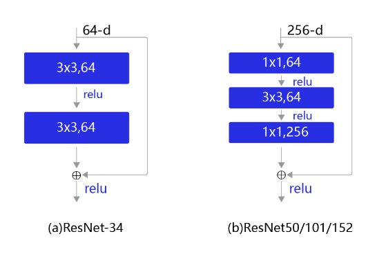

图3 残差块结构示意图

残差块的具体实现如下代码所示：

```python
# ResNet模型代码
import numpy as np
import paddle
import paddle.nn as nn
import paddle.nn.functional as F

# ResNet中使用了BatchNorm层，在卷积层的后面加上BatchNorm以提升数值稳定性
# 定义卷积批归一化块
class ConvBNLayer(paddle.nn.Layer):
    def __init__(self,
                 num_channels,
                 num_filters,
                 filter_size,
                 stride=1,
                 groups=1,
                 act=None):
       
        """
        num_channels, 卷积层的输入通道数
        num_filters, 卷积层的输出通道数
        stride, 卷积层的步幅
        groups, 分组卷积的组数，默认groups=1不使用分组卷积
        """
        super(ConvBNLayer, self).__init__()

        # 创建卷积层
        self._conv = nn.Conv2D(
            in_channels=num_channels,
            out_channels=num_filters,
            kernel_size=filter_size,
            stride=stride,
            padding=(filter_size - 1) // 2,
            groups=groups,
            bias_attr=False)

        # 创建BatchNorm层
        self._batch_norm = paddle.nn.BatchNorm2D(num_filters)
        
        self.act = act

    def forward(self, inputs):
        y = self._conv(inputs)
        y = self._batch_norm(y)
        if self.act == 'leaky':
            y = F.leaky_relu(x=y, negative_slope=0.1)
        elif self.act == 'relu':
            y = F.relu(x=y)
        return y

# 定义残差块
# 每个残差块会对输入图片做三次卷积，然后跟输入图片进行短接
# 如果残差块中第三次卷积输出特征图的形状与输入不一致，则对输入图片做1x1卷积，将其输出形状调整成一致
class BottleneckBlock(paddle.nn.Layer):
    def __init__(self,
                 num_channels,
                 num_filters,
                 stride,
                 shortcut=True):
        super(BottleneckBlock, self).__init__()
        # 创建第一个卷积层 1x1
        self.conv0 = ConvBNLayer(
            num_channels=num_channels,
            num_filters=num_filters,
            filter_size=1,
            act='relu')
        # 创建第二个卷积层 3x3
        self.conv1 = ConvBNLayer(
            num_channels=num_filters,
            num_filters=num_filters,
            filter_size=3,
            stride=stride,
            act='relu')
        # 创建第三个卷积 1x1，但输出通道数乘以4
        self.conv2 = ConvBNLayer(
            num_channels=num_filters,
            num_filters=num_filters * 4,
            filter_size=1,
            act=None)

        # 如果conv2的输出跟此残差块的输入数据形状一致，则shortcut=True
        # 否则shortcut = False，添加1个1x1的卷积作用在输入数据上，使其形状变成跟conv2一致
        if not shortcut:
            self.short = ConvBNLayer(
                num_channels=num_channels,
                num_filters=num_filters * 4,
                filter_size=1,
                stride=stride)

        self.shortcut = shortcut

        self._num_channels_out = num_filters * 4

    def forward(self, inputs):
        y = self.conv0(inputs)
        conv1 = self.conv1(y)
        conv2 = self.conv2(conv1)

        # 如果shortcut=True，直接将inputs跟conv2的输出相加
        # 否则需要对inputs进行一次卷积，将形状调整成跟conv2输出一致
        if self.shortcut:
            short = inputs
        else:
            short = self.short(inputs)

        y = paddle.add(x=short, y=conv2)
        y = F.relu(y)
        return y
```

## 参考文献

[1] [Going deeper with convolutions](https://arxiv.org/pdf/1409.4842.pdf)

[2] [Deep Residual Learning for Image Recognition](https://arxiv.org/pdf/1512.03385.pdf)

# 3D卷积（3D Convolution）

## 一、3D卷积

标准卷积是一种2D卷积，计算方式如 **图1** 所示。在2D卷积中，卷积核在图片上沿着宽和高两个维度滑动，在每次滑动过程时，对应位置的图像元素与卷积核中的参数进行乘加计算，得到输出特征图中的一个值。

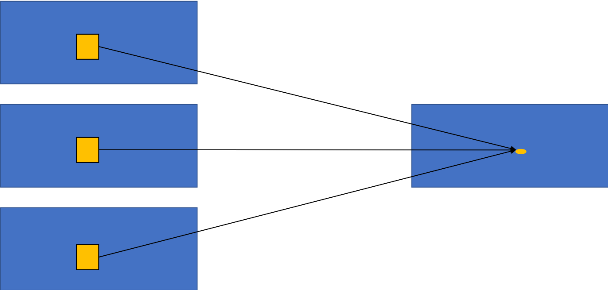

图1 2D卷积示意图

2D卷积仅仅考虑2D图片的空间信息，所以只适用于单张2D图片的视觉理解任务。在处理3D图像或视频时，网络的输入多了一个维度，输入由$(c,height,width)$ 变为了$(c,depth,height,width)$ ，其中$c$ 是通道数，$depth$为输入数据的宽度。因此，对该数据进行处理时，就需要卷积也作出相应的变换，由2D卷积变为3D卷积。

在2D卷积的基础上，3D卷积<sup>[1]</sup>被提出。3D卷积在结构上较2D卷积多了一个维度，2D卷积的尺寸可以表示为$k_h\times{k_w}$ ，而3D卷积的尺寸可以表示为$k_h\times{k_w}\times{k_d}$ 。3D卷积的具体的计算方式与2D卷积类似，即每次滑动时与$c$ 个通道、尺寸大小为$(depth,height,width)$ 的图像做乘加运算，从而得到输出特征图中的一个值，如 **图2** 所示。

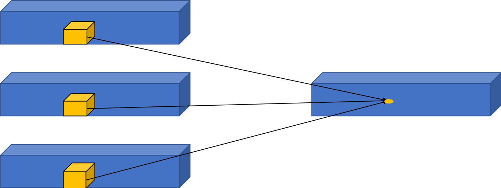

图2 3D卷积示意图

## 二、应用示例

3D卷积的主要应用就是视频理解和医疗图像领域。

在**视频理解任务**中，$k_d$ 就代表了时间维度，也就是每个3D卷积核处理的连续帧数。在视频理解领域的3D卷积计算中，首先会将$k_d$ 个连续帧组成一个3D的图像序列，然后在图像序列中进行卷积计算。3D卷积核会在$k_d$ 个连续帧上进行滑动，每次滑动$k_d$ 个连续帧中对应位置内的元素都要与卷积核中的参数进行乘加计算，最后得到输出特征图中的一个值。

3D CNN中，使用了3D卷积对人体行为进行识别，网络结构如 **图3** 所示。网络只有3个卷积层、1个全连接层以及2个池化层。其中，前两个卷积层为3D卷积层，卷积核大小为$7\times{7}\times{3}$ 和$7\times{6}\times{3}$ ，也就是说每个卷积核处理3个连续帧中$7\times{7}$ 和$7\times{6}$ 大小的区域。

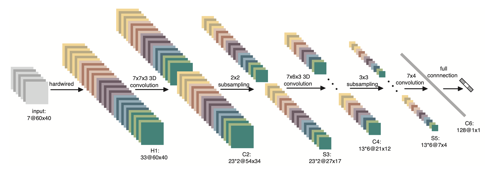

图3 3D CNN网络结构

由于该模型使用了3D卷积，使得其可以从空间和时间的维度提取特征，从而捕捉从多个连续帧中得到的运动信息。

在**医疗图像领域**中，医学数据通常是3D的，比如我们要分割出的肿瘤就是3D的。如果用2D的图像处理模型去处理3D物体也是可以的，但是需要将生物医学影像图片的每一个切片成组的（包含训练数据和标注好的数据）的喂给模型进行训练，在这种情况下会存在一个效率问题，因此我们使用的模型即将U-Net中2D卷积改为3D的形式，即3D U-Net<sup>[2]</sup>，如 **图4** 所示。

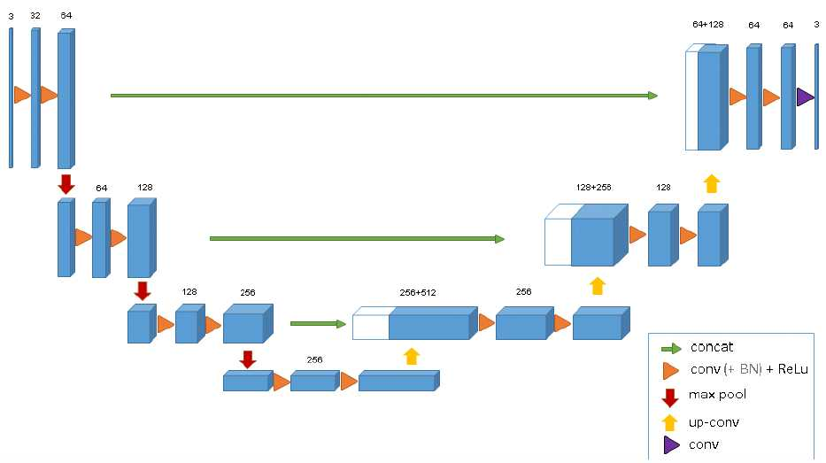

图4 3D U-Net网络结构

该模型的网络结构跟2D结构的U-Net基本一样，唯一不同就是将2D卷积操作换成了3D卷积，因此，不需要单独输入每个切片进行训练，而是可以采取输入整张图片到模型中。

## 参考文献

[1] [3D Convolutional Neural Networks for Human Action Recognition](http://users.eecs.northwestern.edu/~mya671/mypapers/ICML10_Ji_Xu_Yang_Yu.pdf)

[2] [3D U-Net: Learning Dense Volumetric Segmentation from Sparse Annotation](https://arxiv.org/abs/1606.06650)


#  转置卷积（Transpose Convolution）

## 一、转置卷积提出背景

通常情况下，对图像进行卷积运算时，经过多层的卷积运算后，输出图像的尺寸会变得很小，即图像被约减。而对于某些特定的任务（比如：图像分割、GAN），我们需要将图像恢复到原来的尺寸再进行进一步的计算。这个恢复图像尺寸，实现图像由小分辨率到大分辨率映射的操作，叫做上采样（Upsample），如 **图1** 所示。

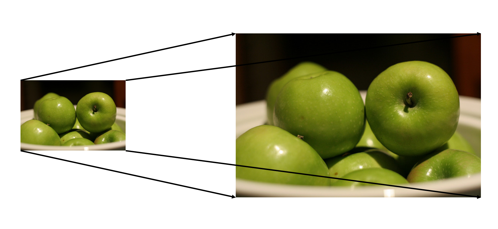

图1 上采样示例

上采样有多种方式，常见的包括：最近邻插值（Nearest neighbor interpolation）、双线性插值（Bi-Linear interpolation）等，但是这些上采样方法都是基于人们的先验经验来设计的，对于很多场景效果并不理想。因此，我们希望让神经网络自己学习如何更好地进行插值，这也就是接下来要介绍的转置卷积（Transpose Convolution）的方法。

## 二、转置卷积及其应用

转置卷积（Transpose Convolution），在某些文献中也被称为反卷积（Deconvolution）。转置卷积中，不会使用预先设定的插值方法，它具有可学习的参数，通过让网络自行学习，来获取最优的上采样方式。转置卷积在某些特定的领域有着非常广泛的应用，比如：

- 在DCGAN<sup>[1]</sup>，生成器将会用随机值转变为一个全尺寸(full-size)的图片，这个时候就需要用到转置卷积。
- 在语义分割中，会使用卷积层在编码器中进行特征提取，然后在解码层中进行恢复为原先的尺寸，这样才可以对原来图像的每个像素都进行分类。这个过程同样需要用到转置卷积。经典方法如：FCN<sup>[2]</sup>和Unet<sup>[3]</sup>。
- CNN的可视化<sup>[4]</sup>：通过转置卷积将CNN中得到的特征图还原到像素空间，以观察特定的特征图对哪些模式的图像敏感。

## 三、转置卷积与标准卷积的区别

标准卷积的运算操作其实就是对卷积核中的元素与输入矩阵上对应位置的元素进行逐像素的乘积并求和。然后使用卷积核在输入矩阵上以步长为单位进行滑动，直到遍历完输入矩阵的所有位置。

这里举一个简单的例子演示一下具体的操作过程。假设输入是一个$4\times{4}$的矩阵，使用$3\times{3}$的标准卷积进行计算，同时不使用填充，步长设置为1。最终输出的结果应该是一个$2\times{2}$的矩阵，如 **图2** 所示。

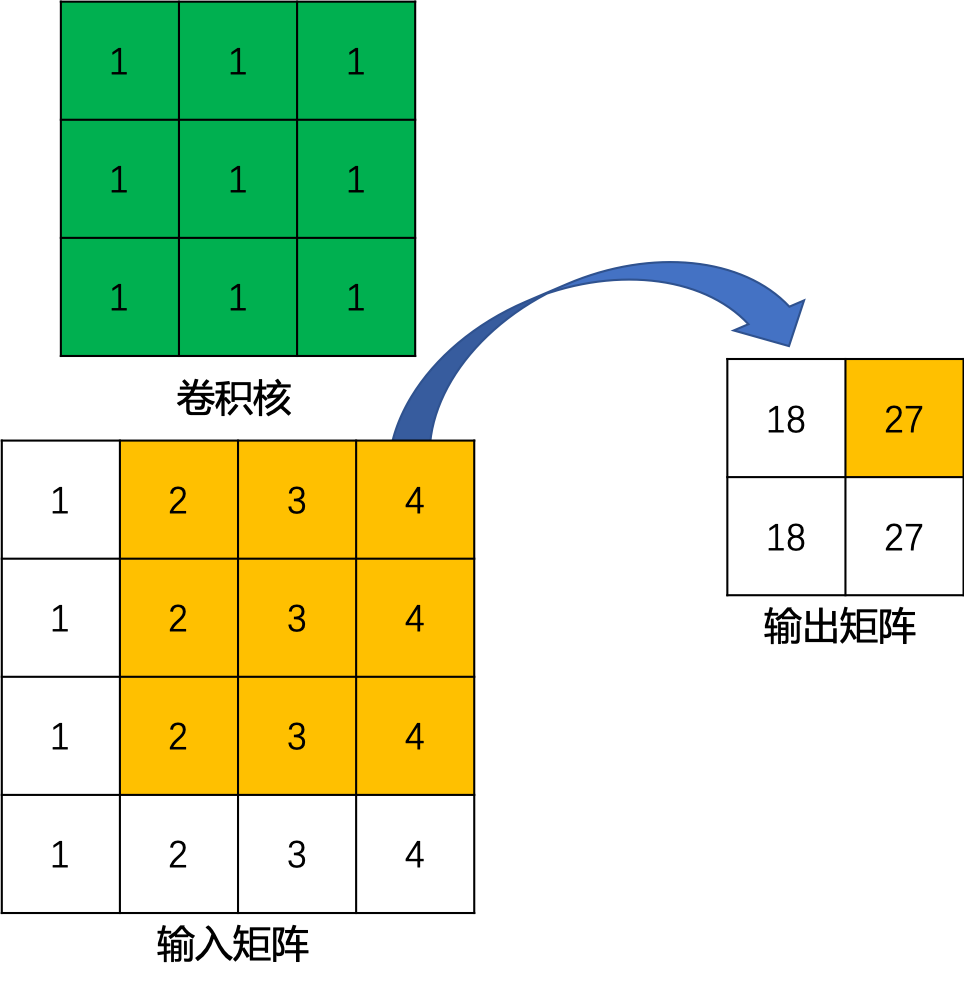

图2 标准卷积运算示例

在上边的例子中，输入矩阵右上角$3\times{3}$的值会影响输出矩阵中右上角的值，这其实也就对应了标准卷积中感受野的概念。所以，我们可以说$3\times{3}$的标准卷积核建立了输入矩阵中9个值与输出矩阵中1个值的对应关系。

综上所述，我们也就可以认为标准卷积操作实际上就是建立了一个多对一的关系。

对于转置卷积而言，我们实际上是想建立一个逆向操作，也就是建立一个一对多的关系。对于上边的例子，我们想要建立的其实是输出卷积中的1个值与输入卷积中的9个值的关系，如 **图3** 所示。

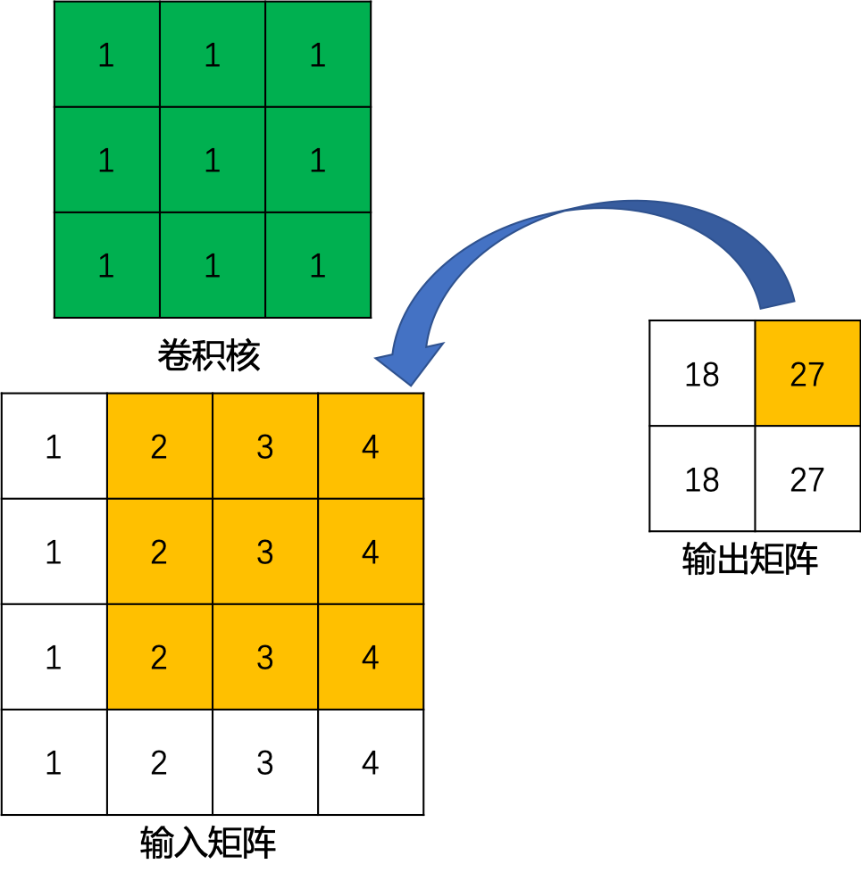

图3 卷积逆向运算示例

当然，从信息论的角度，卷积操作是不可逆的，**所以转置卷积并不是使用输出矩阵和卷积核计算原始的输入矩阵，而是计算得到保持了相对位置关系的矩阵**。

## 四、转置卷积数学推导

定义一个尺寸为$4\times{4}$ 的输入矩阵 $input$:


$$
input=\left[\begin{array}{ccc}
x_1 & x_2 & x_3 & x_4 \\
x_6 & x_7 & x_8 & x_9 \\
x_{10} & x_{11} & x_{12} & x_{13} \\
x_{14} & x_{15} & x_{16} & x_{17} 
\end{array}\right]
$$
一个尺寸为$3\times{3}$ 的标准卷积核 $kernel$:


$$
kernel=\left[\begin{array}{ccc}
w_{0,0} & w_{0,1} & w_{0,2} \\
w_{1,0} & w_{1,1} & w_{1,2} \\
w_{2,0} & w_{2,1} & w_{2,2}
\end{array}\right]
$$


令步长 $stride=1$，填充$padding=0$，按照输出特征图的计算方式$o = \frac{i + 2p - k}{s} + 1$，我们可以得到尺寸为 $2\times{2}$  的输出矩阵 $output$ ：


$$
output=\left[\begin{array}{ccc}
y_0 & y_1 \\
y_2 & y_3
\end{array}\right]
$$
这里，我们换一个表达方式，我们将输入矩阵 $ input$ 和输出矩阵 $output$ 展开成列向量$X$ 和列向量$Y$ ，那么向量$X$ 和向量$Y$ 的尺寸就分别是$16\times{1}$ 和$4\times{1}$，可以分别用如下公式表示：


$$
X=\left[\begin{array}{ccc}
x_1 \\ x_2 \\ x_3 \\ x_4 \\
x_6 \\ x_7 \\ x_8 \\ x_9 \\
x_{10} \\ x_{11} \\ x_{12} \\ x_{13} \\
x_{14} \\ x_{15} \\ x_{16} \\ x_{17} 
\end{array}\right]
$$

$$
Y=\left[\begin{array}{ccc}
y_0 \\ y_1 \\
y_2 \\ y_3
\end{array}\right]
$$

我们再用矩阵运算来描述标准卷积运算，这里使用矩阵$C$ 来表示新的卷积核矩阵：


$$
Y = CX
$$
经过推导，我们可以得到这个稀疏矩阵$C$，它的尺寸为$4\times{16}$：


$$
\scriptsize{
C=\left[\begin{array}{ccc}
w_{0,0} & w_{0,1} & w_{0,2} & 0 & w_{1,0} & w_{1,1} & w_{1,2} & 0 & w_{2,0} & w_{2,1} & w_{2,2} & 0 & 0 & 0 & 0 & 0 \\
0 & w_{0,0} & w_{0,1} & w_{0,2} & 0 & w_{1,0} & w_{1,1} & w_{1,2} & 0 & w_{2,0} & w_{2,1} & w_{2,2} & 0 & 0 & 0 & 0 \\
0 & 0 & 0 & 0 & w_{0,0} & w_{0,1} & w_{0,2} & 0 & w_{1,0} & w_{1,1} & w_{1,2} & 0 & w_{2,0} & w_{2,1} & w_{2,2} & 0 \\
0 & 0 & 0 & 0 & 0 & w_{0,0} & w_{0,1} & w_{0,2} & 0 & w_{1,0} & w_{1,1} & w_{1,2} & 0 & w_{2,0} & w_{2,1} & w_{2,2}  
\end{array}\right]
}
$$
这里，我们用 **图4** 为大家直观的展示一下上边的矩阵运算过程。

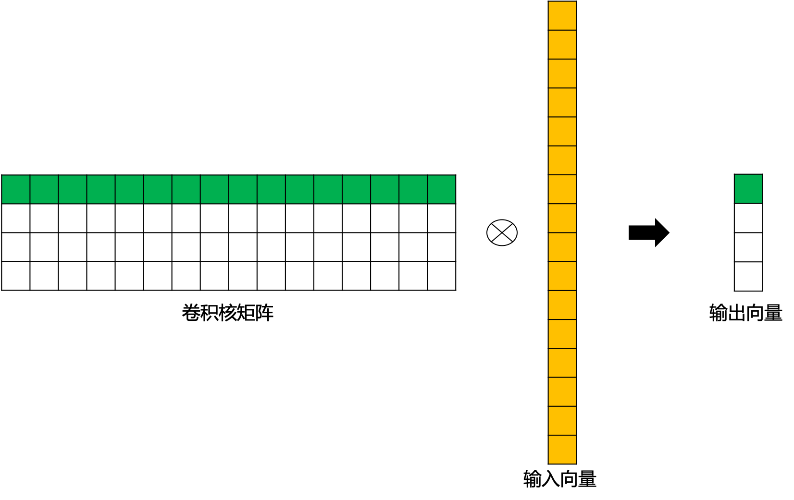

图4 标准卷积矩阵运算示例

而转置卷积其实就是要对这个过程进行逆运算，即通过 $C$ 和 $Y$ 得到 $X$ ：


$$
X = C^TY
$$
此时，新的稀疏矩阵就变成了尺寸为$16\times{4}$ 的$C^T$，这里我们通过 **图5** 为大家直观展示一下转置后的卷积矩阵运算示例。这里，用来进行转置卷积的权重矩阵不一定来自于原卷积矩阵. 只是权重矩阵的形状和转置后的卷积矩阵相同。

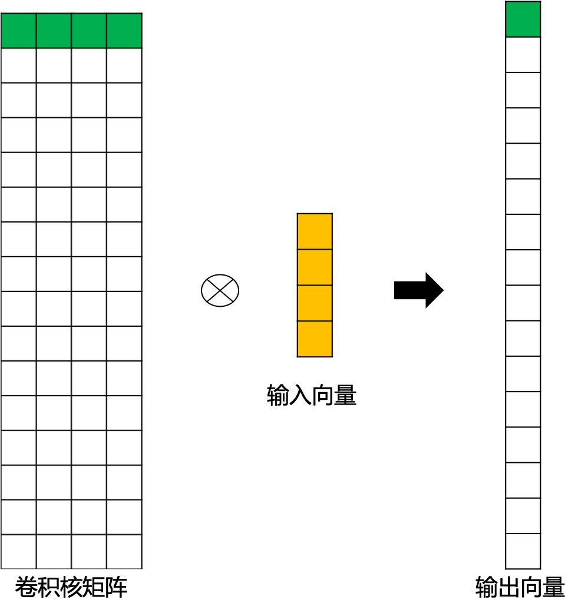

图5 转置后卷积矩阵运算示例

我们再将$16\times{1}$ 的输出结果进行重新排序，这样就可以通过尺寸为$2\times{2}$ 的输入矩阵得到尺寸为$4\times{4}$ 的输出矩阵了。

## 五、转置卷积输出特征图尺寸

- **stride=1的转置卷积**

我们同样使用上文中的卷积核矩阵$C$：


$$
\scriptsize{
C=\left[\begin{array}{ccc}w_{0,0} & w_{0,1} & w_{0,2} & 0 & w_{1,0} & w_{1,1} & w_{1,2} & 0 & w_{2,0} & w_{2,1} & w_{2,2} & 0 & 0 & 0 & 0 & 0 \\0 & w_{0,0} & w_{0,1} & w_{0,2} & 0 & w_{1,0} & w_{1,1} & w_{1,2} & 0 & w_{2,0} & w_{2,1} & w_{2,2} & 0 & 0 & 0 & 0 \\0 & 0 & 0 & 0 & w_{0,0} & w_{0,1} & w_{0,2} & 0 & w_{1,0} & w_{1,1} & w_{1,2} & 0 & w_{2,0} & w_{2,1} & w_{2,2} & 0 \\0 & 0 & 0 & 0 & 0 & w_{0,0} & w_{0,1} & w_{0,2} & 0 & w_{1,0} & w_{1,1} & w_{1,2} & 0 & w_{2,0} & w_{2,1} & w_{2,2}  \end{array}\right]
}
$$
对应的输出矩阵 $output$ 为 ：


$$
output=\left[\begin{array}{ccc}y_0 & y_1 \\y_2 & y_3\end{array}\right]
$$
我们将输出矩阵展开为列向量$Y$ ：


$$
Y=\left[\begin{array}{ccc}y_0 \\ y_1 \\y_2 \\ y_3\end{array}\right]
$$
带入到上文中提到的转置卷积计算公式，则转置卷积的计算结果为：


$$
\scriptsize{
C^Ty'=
\left[\begin{array}{ccc}
w_{0,0}y_0 & w_{0,1}y_0+w_{0,0}y_1 & w_{0,2}y_0+w_{0,1}y_1 & w_{0,2}y_1 \\
w_{1,0}y_0+w_{0,0}y_2 & w_{1,1}y_0+w_{1,0}y_1+w_{0,1}y_2+w_{0,0}y_3 & w_{1,2}y_0+w_{1,1}y_1+w_{0,2}y_2+w_{0,1}y_3 & w_{1,2}y_1+w_{0,2}y_3 \\
w_{2,0}y_0+w_{1,0}y_2 & w_{2,1}y_0+w_{2,0}y_1+w_{1,1}y_2+w_{1,0}y_3 & w_{2,2}y_0+w_{2,1}y_1+w_{1,2}y_2+w_{1,1}y_3 & w_{2,2}y_1+w_{1,2}y_3 \\
w_{2,0}y_2 & w_{2,1}y_2+w_{2,0}y_3 & w_{2,2}y_2+w_{2,1}y_3 & w_{2,2}y_3
\end{array}\right]
}
$$
这其实就等价于填充 $padding=2$，输入为：


$$
input=\left[\begin{array}{ccc}
0 & 0 & 0 & 0 & 0 & 0 \\
0 & 0 & 0 & 0 & 0 & 0 \\
0 & 0 & y_0 & y_1 & 0 & 0 \\
0 & 0 & y_2 & y_3 & 0 & 0 \\
0 & 0 & 0 & 0 & 0 & 0 \\
0 & 0 & 0 & 0 & 0 & 0
\end{array}\right]
$$
同时，标准卷积核进行转置：


$$
kernel‘=\left[\begin{array}{ccc}
w_{2,2} & w_{2,1} & w_{2,0} \\
w_{1,2} & w_{1,1} & w_{1,0} \\
w_{0,2} & w_{0,1} & w_{0,0}
\end{array}\right]
$$
之后的标准卷积的结果，运算过程如 **图6** 所示。


图6 s=1时，转置卷积运算示例

对于卷积核尺寸为 $k$，步长 $stride=1$，填充 $padding=0$ 的标准卷积，等价的转置卷积在尺寸为 $ i'$ 的输入矩阵上进行运算，输出特征图的尺寸 $ o'$ 为：


$$
o' = i'+(k-1)
$$
同时，转置卷积的输入矩阵需要进行 $padding'=k-1$ 的填充。

- **stride>1的转置卷积**

在实际使用的过程中，我们大多数时候使用的会是stride>1的转置卷积，从而获得较大的上采样倍率。这里，我们令输入尺寸为$5\times{5}$，标准卷积核的设置同上，步长 $stride=2$，填充 $padding=0$，标准卷积运算后，输出尺寸为$2\times{2}$。


$$
Y=\left[\begin{array}{ccc}y_0 \\ y_1 \\y_2 \\ y_3\end{array}\right]
$$
这里，步长$stride=2$，转换后的稀疏矩阵尺寸变为$25\times{4}$，由于矩阵太大这里不展开进行罗列。则转置卷积的结果为：


$$
\scriptsize{
C^Ty'=\left[\begin{array}{ccc}
w_{0,0}y_0 & w_{0,1}y_0 & w_{0,2}y_0+w_{0,0}y_1 & w_{0,1}y_1 & w_{0,2}y_1\\
w_{1,0}y_0 & w_{1,1}y_0 & w_{1,2}y_0+w_{1,0}y_1 & w_{1,1}y_1 & w_{1,2}y_1\\
w_{2,0}y_0+w_{0,0}y_2 & w_{2,1}y_0+w_{0,1}y_2 & w_{2,2}y_0+w_{2,0}y_1+w_{0,2}y_2+w_{0,0}y_3 & w_{2,1}y_1+w_{0,1}y_3 & w_{2,2}y_1+w_{0,2}y_3\\
w_{1,0}y_2 & w_{1,1}y_2 & w_{1,2}y_2+w_{1,0}y_3 & w_{1,1}y_3 & w_{1,2}y_3\\
w_{2,0}y_2 & w_{2,1}y_2 & w_{2,2}y_2+w_{2,0}y_3 & w_{2,1}y_3 & w_{2,2}y_3\\
\end{array}\right]
}
$$
此时，等价于输入矩阵添加了空洞，同时也添加了填充，标准卷积核进行转置之后的运算结果。运算过程如 **图7** 所示。

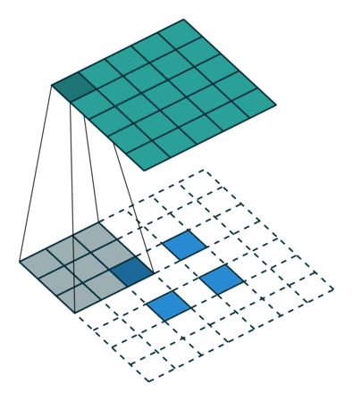

图7 s>1时，转置卷积运算示例

对于卷积核尺寸为 $k$，步长 $stride>1$，填充 $padding=0$ 的标准卷积，等价的转置卷积在尺寸为 $ i'$ 的输入矩阵上进行运算，输出特征图的尺寸 $ o'$ 为：


$$
o' = s(i'-1)+k
$$
同时，转置卷积的输入矩阵需要进行 $padding'=k-1$ 的填充，相邻元素间的空洞大小为 $s-1$。因此，可以通过控制步长 $stride$ 来控制上采样倍率。

## 参考文献

[1] [Unsupervised Representation Learning with Deep Convolutional Generative Adversarial Networks](https://arxiv.org/pdf/1511.06434.pdf)

[2] [Fully Convolutional Networks for Semantic Segmentation](https://www.cv-foundation.org/openaccess/content_cvpr_2015/html/Long_Fully_Convolutional_Networks_2015_CVPR_paper.html)

[3] [U-Net: Convolutional Networks for Biomedical Image Segmentation](https://arxiv.org/pdf/1505.04597.pdf)

[4] [Visualizing and Understanding Convolutional Networks](https://arxiv.org/pdf/1311.2901v2.pdf)

# 空洞卷积（Dilated Convolution）

## 一、空洞卷积提出背景

在像素级预测问题中（比如语义分割，这里以FCN<sup>[1]</sup>为例进行说明），图像输入到网络中，FCN先如同传统的CNN网络一样对图像做卷积以及池化计算，降低特征图尺寸的同时增大感受野。但是由于图像分割是一种像素级的预测问题，因此我们使用转置卷积（Transpose Convolution）进行上采样使得输出图像的尺寸与原始的输入图像保持一致。综上，在这种像素级预测问题中，就有两个关键步骤：首先是使用卷积或者池化操作减小图像尺寸，增大感受野；其次是使用上采样扩大图像尺寸。但是，使用卷积或者池化操作进行下采样会导致一个非常严重的问题：图像细节信息被丢失，小物体信息将无法被重建(假设有4个步长为2的池化层，则任何小于 $2^4$pixel 的物体信息将理论上无法重建)。

## 二、空洞卷积及其应用

空洞卷积(Dilated Convolution)，在某些文献中也被称为扩张卷积（Atrous Deconvolution），是针对图像语义分割问题中下采样带来的图像分辨率降低、信息丢失问题而提出的一种新的卷积思路。空洞卷积通过引入扩张率（Dilation Rate）这一参数使得同样尺寸的卷积核获得更大的感受野。相应地，也可以使得在相同感受野大小的前提下，空洞卷积比普通卷积的参数量更少。

空洞卷积在某些特定的领域有着非常广泛的应用，比如：

- 语义分割领域：DeepLab系列<sup>[2,3,4,5]</sup>与DUC<sup>[6]</sup>。在DeepLab v3算法中，将ResNet最后几个block替换为空洞卷积，使得输出尺寸变大了很多。在没有增大运算量的前提下，维持分辨率不降低，获得了更密集的特征响应，从而使得还原到原图时细节更好。

- 目标检测领域：RFBNet<sup>[7]</sup>。在RFBNet算法中，利用空洞卷积来模拟pRF在人类视觉皮层中的离心率的影响，设计了RFB模块，从而增强轻量级CNN网络的效果。提出基于RFB网络的检测器，通过用RFB替换SSD的顶部卷积层，带来了显著的性能增益，同时仍然保持受控的计算成本。

- 语音合成领域：WaveNet<sup>[8]</sup>等算法。

## 三、空洞卷积与标准卷积的区别

对于一个尺寸为 $3\times{3}$ 的标准卷积，卷积核大小为  $3\times{3}$ ，卷积核上共包含9个参数，在卷积计算时，卷积核中的元素会与输入矩阵上对应位置的元素进行逐像素的乘积并求和。而空洞卷积与标准卷积相比，多了扩张率这一个参数，扩张率控制了卷积核中相邻元素间的距离，扩张率的改变可以控制卷积核感受野的大小。尺寸为 $3\times{3}$ ，扩张率分别为 $1,2,4$ 时的空洞卷积分别如 **图1**，**图2**，**图3**所示。

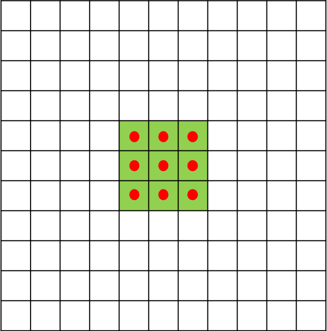

图1 扩张率为1时的3*3空洞卷积

扩张率为1时，空洞卷积与标准卷积计算方式一样。

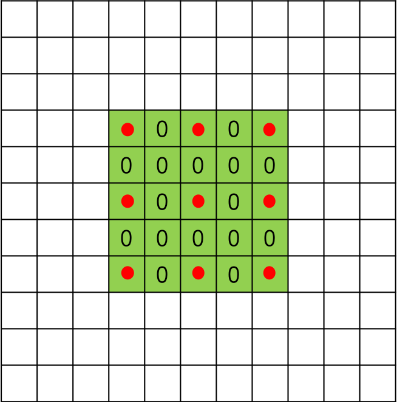

图2 扩张率为2时的3*3空洞卷积

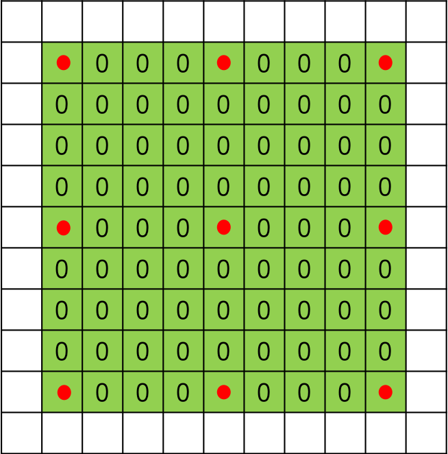

图3 扩张率为4时的3*3空洞卷积

扩张率大于1时，在标准卷积的基础上，会注入空洞，空洞中的数值全部填0。

## 四、空洞卷积的感受野

对于标准卷积而言，当标准卷积核尺寸为 $3\times{3}$ 时，我们在输入矩阵上连续进行两次标准卷积计算，得到两个特征图。我们可以观察不同层数的卷积核感受野大小，如 **图4** 所示。


图4 标准卷积的感受野示例

其中，$3\times3$卷积对应的感受野大小就是$3\times3$，而通过两层$3\times3$的卷积之后，感受野的大小将会增加到$5\times5$。

空洞卷积的感受野计算方式与标准卷积大同小异。由于空洞卷积实际上可以看作在标准卷积核内填充'0'，所以我们可以将其想象为一个尺寸变大的标准卷积核，从而使用标准卷积核计算感受野的方式来计算空洞卷积的感受野大小。对于卷积核大小为 $k$ ，扩张率为 $r$ 的空洞卷积，感受野 $F$ 的计算公式为：

$$F = k + (k-1)(r-1)$$

卷积核大小 $k=3$ ，扩张率 $r=2$ 时，计算方式如 **图5** 所示。

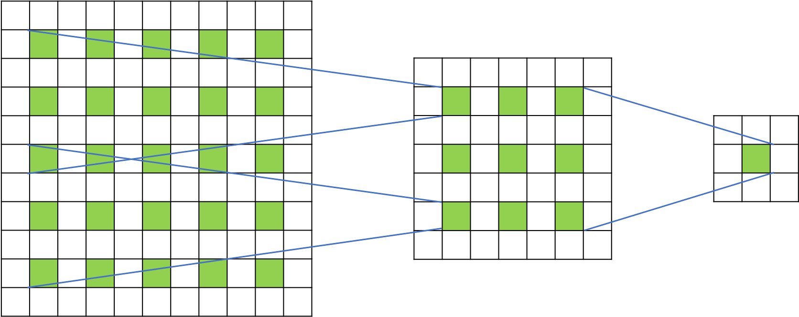

图5 空洞卷积的感受野示例

其中，通过一层空洞卷积后，感受野大小为$5\times5$，而通过两层空洞卷积后，感受野的大小将会增加到$9\times9$。

## 参考文献

[1] [Fully Convolutional Networks for Semantic Segmentation](https://www.cv-foundation.org/openaccess/content_cvpr_2015/html/Long_Fully_Convolutional_Networks_2015_CVPR_paper.html)

[2] [Semantic image segmentation with deep convolutional nets and fully connected CRFs](https://arxiv.org/pdf/1412.7062v3.pdf)

[3] [DeepLab: Semantic Image Segmentation with Deep Convolutional Nets, Atrous Convolution, and Fully Connected CRFs](https://arxiv.org/pdf/1606.00915.pdf)

[4] [Rethinking Atrous Convolution for Semantic Image Segmentation](https://arxiv.org/pdf/1706.05587.pdf)

[5] [Encoder-Decoder with Atrous Separable Convolution for Semantic Image Segmentation](https://arxiv.org/pdf/1802.02611.pdf)

[6] [Understanding Convolution for Semantic Segmentation](https://arxiv.org/pdf/1702.08502.pdf)

[7 ] [Receptive Field Block Net for Accurate and Fast Object Detection](https://arxiv.org/pdf/1711.07767.pdf)

[8] [WaveNet: a generative model for raw audio](https://arxiv.org/pdf/1609.03499.pdf)

# 分组卷积（Group Convolution）

## 一、分组卷积提出背景

分组卷积（Group Convolution）最早出现在AlexNet<sup>[1]</sup>中。受限于当时的硬件资源，在AlexNet网络训练时，难以把整个网络全部放在一个GPU中进行训练，因此，作者将卷积运算分给多个GPU分别进行计算，最终把多个GPU的结果进行融合。因此分组卷积的概念应运而生。

## 二、分组卷积与标准卷积的区别

对于尺寸为 $H_1\times{W_1}\times{C_1}$ 的输入矩阵，当标准卷积核的尺寸为 $h_1\times{w_1}\times{C_1}$ ，共有 $C_2$ 个标准卷积核时，标准卷积会对完整的输入数据进行运算，最终得到的输出矩阵尺寸为 $H_2\times{W_2}\times{C_2}$ 。这里我们假设卷积运算前后的特征图尺寸保持不变，则上述过程可以展示为 **图1** 。

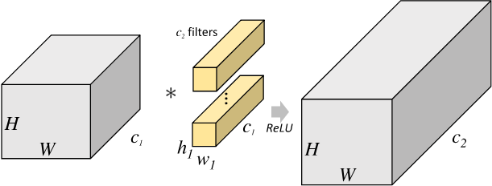

图1 标准卷积示意图

考虑到上述过程是完整运行在同一个设备上，这也对设备的性能提出了较高的要求。

分组卷积则是针对这一过程进行了改进。分组卷积中，通过指定组数 $g$ 来确定分组数量，将输入数据分成 $g$ 组。需要注意的是，这里的分组指的是在深度上进行分组，输入的宽和高保持不变，即将每 $\frac{C_1}{g}$ 个通道的数据分为一组。因为输入数据发生了改变，相应的卷积核也需要进行对应的变化，即每个卷积核的输入通道数也就变为了 $\frac{C_1}{g}$ ，而卷积核的大小是不需要改变的。同时，每组的卷积核个数也由原来的 $C_2$ 变为 $\frac{C_2}{g}$ 。对于每个组内的卷积运算，同样采用标准卷积运算的计算方式，这样就可以得到 $g$ 组尺寸为 $H_2\times{W_2}\times{\frac{C_2}{g}}$ 的输出矩阵，最终将这 $g$ 组输出矩阵进行拼接就可以得到最终的结果。这样拼接完成后，最终的输出尺寸就可以保持不变，仍然是 $H_2\times{W_2}\times{C_2}$ 。分组卷积的运算过程如 **图2** 所示。

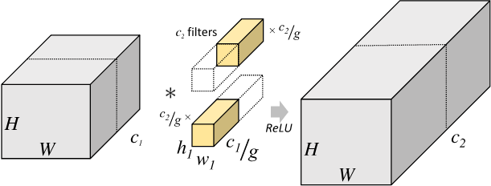

图2 分组卷积示意图

由于我们将整个标准卷积过程拆分成了 $g$ 组规模更小的子运算来并行进行，所以最终降低了对运行设备的要求。同时，通过分组卷积的方式，参数量也可以得到降低。在上述的标准卷积中，参数量为：


$$
h_1 \times w_1 \times C_1 \times C_2
$$
而使用分组卷积后，参数量则变为：


$$
h_1 \times w_1 \times \frac{C_1}{g} \times \frac{C_2}{g} \times g = h_1 \times w_1 \times C_1 \times C_2 \times \frac{1}{g}
$$

## 三、应用示例

比如对于尺寸为 $H\times{W}\times{64}$ 的输入矩阵，当标准卷积核的尺寸为 $3\times{3}\times{64}$ ，共有 $64$ 个标准卷积核时，**图3** 为组数 $g=2$ 时的分组卷积计算方式。

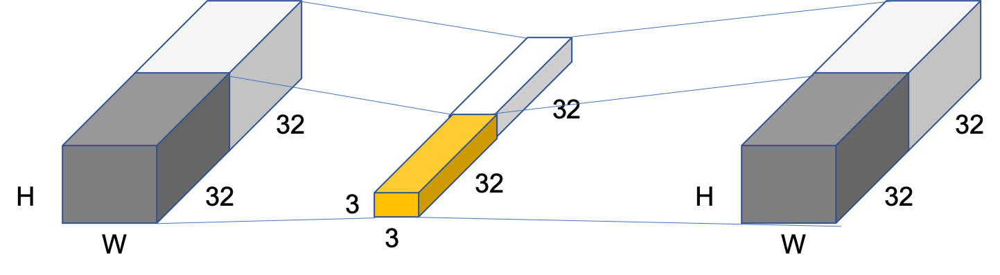

图3 组数为2时分组卷积示意图

此时，每组的输入通道数变为32，卷积核通道数也变为为32。所以，标准卷积对应的参数量是 $3\times{3}\times{64}\times{64}=36864$ ，而分组卷积的参数量变为 $3\times{3}\times{32}\times{32}\times{2}=18432$，参数量减少了一半。

## 参考文献

[1] [ImageNet Classification with Deep Convolutional Neural Networks](http://stanford.edu/class/cs231m/references/alexnet.pdf)

# 可分离卷积（Separable Convolution）

## 一、可分离卷积提出背景

传统的卷积神经网络在计算机视觉领域已经取得了非常好的成绩，但是依然存在一个待改进的问题—计算量大。

当卷积神经网络应用到实际工业场景时，模型的参数量和计算量都是十分重要的指标，较小的模型可以高效地进行分布式训练，减小模型更新开销，降低平台体积功耗存储和计算能力的限制，方便部署在移动端。

因此，为了更好地实现这个需求，在卷积运算的基础上，学者们提出了更为高效的可分离卷积。

## 二、空间可分离卷积

空间分离卷积（spatial separable convolutions），顾名思义就是在空间维度将标准卷积运算进行拆分，将标准卷积核拆分成多个小卷积核。例如我们可以将卷积核拆分成两个（或多个）向量的外积：


$$
\left[\begin{array}{ccc}
3 & 6 & 9 \\
4 & 8 & 12 \\
5 & 10 & 15
\end{array}\right]
=	
\left[\begin{array}{ccc}
3 \\
4 \\
5
\end{array}\right]	
\times
\left[\begin{array}{ccc}
1 \quad 2 \quad 3
\end{array}\right]
$$

此时，对于一副输入图像而言，我们就可以先用$3\times1$的kernel做一次卷积，再用$1\times3$的kernel做一次卷积，从而得到最终结果。具体操作如 **图1** 所示。

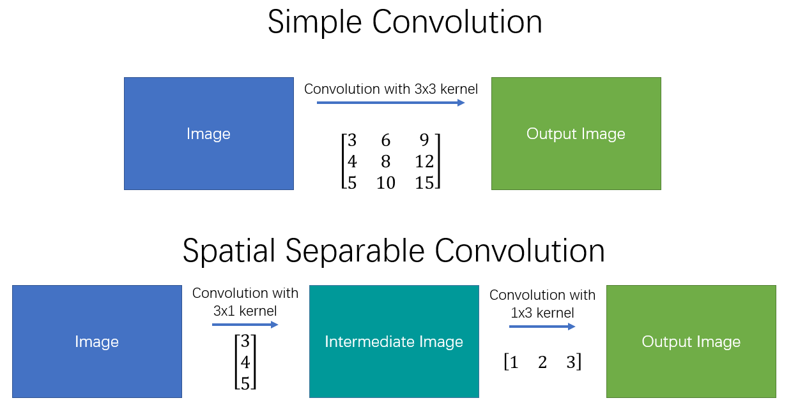

图1 空间可分离卷积

这样，我们将原始的卷积进行拆分，本来需要9次乘法操作的一个卷积运算，就变为了两个需要3次乘法操作的卷积运算，并且最终效果是不变的。可想而知，乘法操作减少，计算复杂性就降低了，网络运行速度也就更快了。

但是空间可分离卷积也存在一定的问题，那就是并非所有的卷积核都可以拆分成两个较小的卷积核。 所以这种方法使用的并不多。

### 应用示例

空间可分离卷积在深度学习中应用较少，在传统图像处理领域比较有名的是可用于边缘检测的sobel算子，分离的sobel算子计算方式如下：


$$
\left[\begin{array}{ccc}
-1 & 0 & 1 \\
-2 & 0 & 2 \\
-1 & 0 & 1
\end{array}\right]
=	
\left[\begin{array}{ccc}
1 \\
2 \\
1
\end{array}\right]	
\times
\left[\begin{array}{ccc}
-1 \quad 0 \quad 1
\end{array}\right]
$$

## 三、深度可分离卷积

深度可分离卷积（depthwise separable convolutions）的不同之处在于，其不仅仅涉及空间维度，还涉及深度维度（即 channel 维度）。通常输入图像会具有3个channel：R、G、B。在经过一系列卷积操作后，输入特征图就会变为多个channel。对于每个channel而言，我们可以将其想成对该图像某种特定特征的解释说明。例如输入图像中，“红色” channel 解释描述了图像中的“红色”特征，“绿色” channel 解释描述了图像中的“绿色”特征，“蓝色” channel 解释描述了图像中的“蓝色”特征。又例如 channel 数量为64的输出特征图，就相当于对原始输入图像的64种不同的特征进行了解释说明。

类似空间可分离卷积，深度可分离卷积也是将卷积核分成两个单独的小卷积核，分别进行2种卷积运算：深度卷积运算和逐点卷积运算。 首先，让我们看看正常的卷积是如何工作的。

### 标准卷积

假设我们有一个 $12\times 12\times 3$ 的输入图像，即图像尺寸为 $12\times 12$，通道数为3，对图像进行 $5\times 5$ 卷积，没有填充（padding）且步长为1。如果我们只考虑图像的宽度和高度，使用 $5\times 5$ 卷积来处理 $12\times 12$ 大小的输入图像，最终可以得到一个 $8\times 8$ 的输出特征图。然而，由于图像有3个通道，我们的卷积核也需要有3个通道。 这就意味着，卷积核在每个位置进行计算时，实际上会执行 $5\times 5\times 3=75$ 次乘法。如 **图2** 所示，我们使用一个 $5\times 5\times 3$ 的卷积核进行卷积运算，最终可以得到 $8\times 8\times 1$ 的输出特征图。

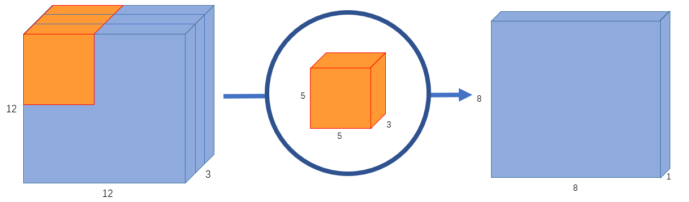

图2 输出通道为1的标准卷积

如果我们想增加输出的 channel 数量让网络学习更多种特征呢？这时我们可以创建多个卷积核，比如256个卷积核来学习256个不同类别的特征。此时，256个卷积核会分别进行运算，得到256个 $8\times 8\times 1$ 的输出特征图，将其堆叠在一起，最终可以得到 $8\times 8\times 256$ 的输出特征图。如 **图3** 所示。

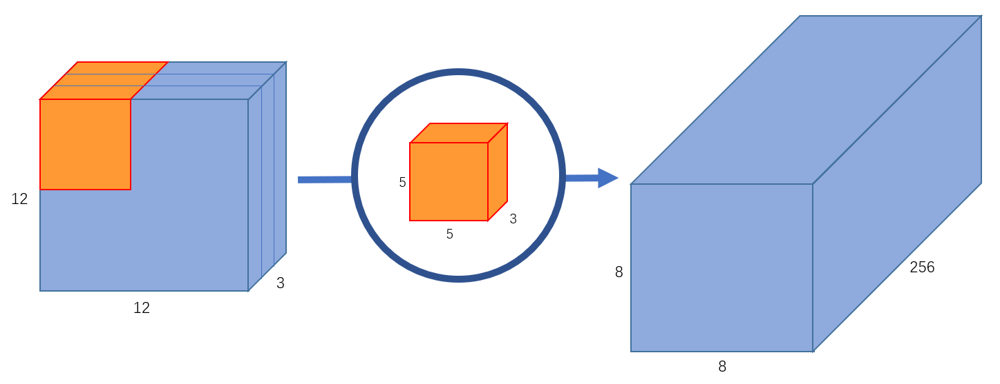

图3 输出通道为256的标准卷积

接下来，再来看一下如何通过深度可分离卷积得到 $8\times 8\times 256$ 的输出特征图。

### 深度卷积运算

首先，我们对输入图像进行深度卷积运算，这里的深度卷积运算其实就是逐通道进行卷积运算。对于一幅 $12\times 12\times 3$ 的输入图像而言，我们使用大小为 $5\times 5$ 的卷积核进行逐通道运算，计算方式如 **图4** 所示。

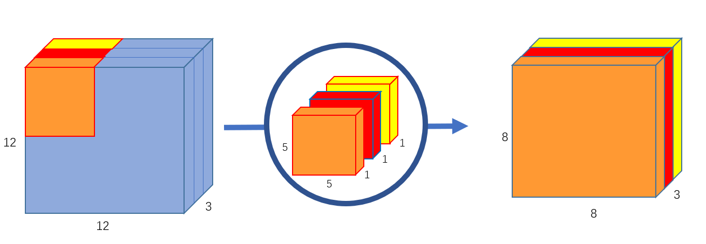

图4 深度卷积运算

这里其实就是使用3个 $5\times 5\times 1$ 的卷积核分别提取输入图像中3个 channel 的特征，每个卷积核计算完成后，会得到3个 $8\times 8\times 1$ 的输出特征图，将这些特征图堆叠在一起就可以得到大小为 $8\times 8\times 3$ 的最终输出特征图。这里我们可以发现深度卷积运算的一个缺点，深度卷积运算缺少通道间的特征融合 ，并且运算前后通道数无法改变。

因此，接下来就需要连接一个逐点卷积来弥补它的缺点。

### 逐点卷积运算

前面我们使用深度卷积运算完成了从一幅 $12\times 12\times 3$ 的输入图像中得到 $8\times 8\times 3$ 的输出特征图，并且发现仅使用深度卷积无法实现不同通道间的特征融合，而且也无法得到与标准卷积运算一致的 $8\times 8\times 256$ 的特征图。那么，接下来就让我们看一下如何使用逐点卷积实现这两个任务。

逐点卷积其实就是 $1\times 1$ 卷积，因为其会遍历每个点，所以我们称之为逐点卷积。  $1\times 1$ 卷积在前面的内容中已经详细介绍了，这里我们还是结合上边的例子看一下它的具体作用。

我们使用一个3通道的 $1\times 1$ 卷积对上文中得到的 $8\times 8\times 3$ 的特征图进行运算，可以得到一个 $8\times 8\times 1$ 的输出特征图。如 **图5** 所示。此时，我们就使用逐点卷积实现了融合3个通道间特征的功能。

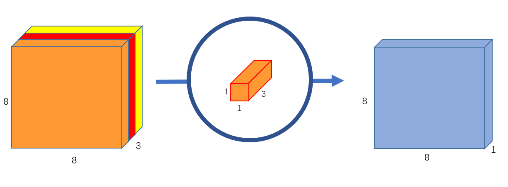

图5 输出通道为1的逐点卷积

此外，我们可以创建256个3通道的 $1\times 1$ 卷积对上文中得到的 $8\times 8\times 3$ 的特征图进行运算，这样，就可以实现得到与标准卷积运算一致的 $8\times 8\times 256$ 的特征图的功能。如 **图6** 所示。

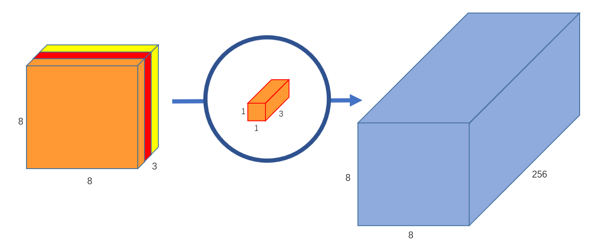

图6 输出通道为256的逐点卷积

### 深度可分离卷积的意义

上文中，我们给出了深度可分离卷积的具体计算方式，那么使用深度可分离卷积代替标准卷积有什么意义呢？

这里我们看一下上文例子中标准卷积的乘法运算个数，我们创建了256个 $5\times 5\times 3$ 的卷积核进行卷积运算，每个卷积核会在输入图片上移动 $8\times 8$ 次，因此总的乘法运算个数为：


$$
256 \times 3 \times 5 \times 5 \times 8 \times 8=1228800
$$
而换成深度可分离卷积后，在深度卷积运算时，我们使用3个 $5\times 5\times 1$ 的卷积核在输入图片上移动 $8\times 8$ 次，此时乘法运算个数为：


$$
3 \times 5 \times 5 \times 8 \times 8=4800
$$
在逐点卷积运算时，我们使用256个 $1\times 1\times 3$ 的卷积在输入特征图上移动 $8\times 8$ 次，此时乘法运算个数为：


$$
256 \times 1 \times 1 \times 3 \times 8 \times 8=49152
$$
将这两步运算相加，即可得到，使用深度可分离卷积后，总的乘法运算个数变为：53952。可以看到，深度可分离卷积的运算量相较标准卷积而言，计算量少了很多。

### 应用示例

MobileNetv1<sup>[1]</sup>中使用的深度可分离卷积如 **图7** 右侧所示。相较于左侧的标准卷积，其进行了拆分，同时使用了BN层以及RELU激活函数穿插在深度卷积运算和逐点卷积运算中。

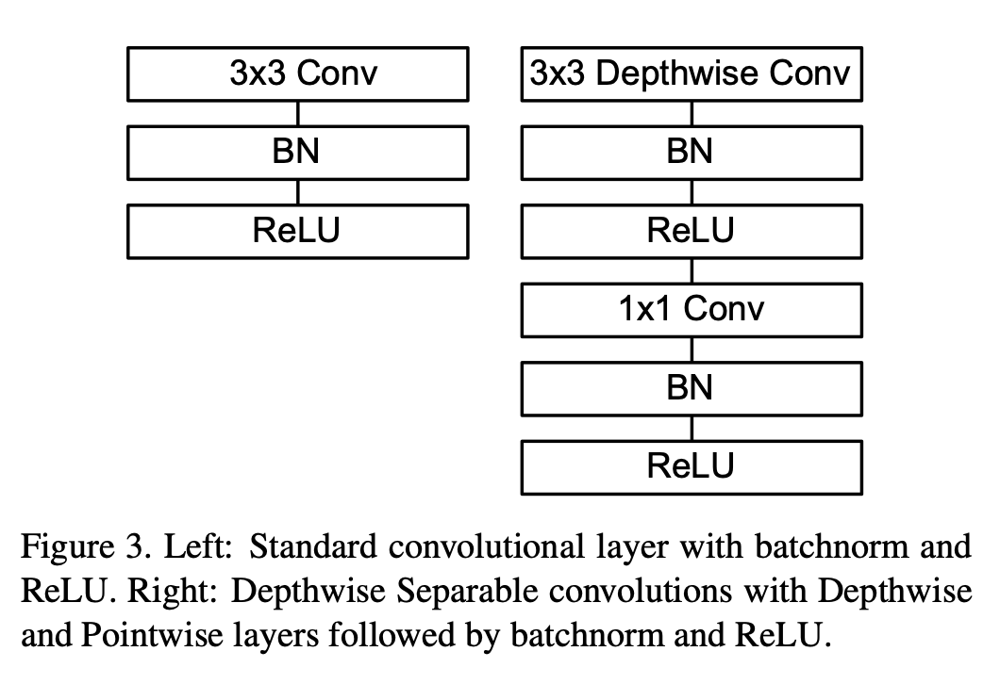

图7 MobileNetv1中的可分离卷积

### 参考文献

[1] [MobileNets: Efficient Convolutional Neural Networks for Mobile Vision Applications](https://arxiv.org/pdf/1704.04861.pdf)

# 可变形卷积详解

## 提出背景

视觉识别的一个关键挑战是如何适应物体尺度、姿态、视点和零件变形的几何变化或模型几何变换。

但对于视觉识别的传统CNN模块，不可避免的都存在**固定几何结构**的缺陷：卷积单元在固定位置对输入特征图进行采样；池化层以固定比率降低空间分辨率；一个ROI（感兴趣区域）池化层将一个ROI分割成固定的空间单元；缺乏处理几何变换的内部机制等。

这些将会引起一些明显的问题。例如，同一CNN层中所有激活单元的感受野大小是相同的，这对于在空间位置上编码语义的高级CNN层是不需要的。而且，对于具有精细定位的视觉识别（例如，使用完全卷积网络的语义分割）的实际问题，由于不同的位置可能对应于具有不同尺度或变形的对象，因此，尺度或感受野大小的自适应确定是可取的。

为了解决以上所提到的局限性，一个自然地想法就诞生了：**卷积核自适应调整自身的形状**。这就产生了可变形卷积的方法。

## 可变形卷积

### DCN v1

可变形卷积顾名思义就是卷积的位置是可变形的，并非在传统的$N × N$的网格上做卷积，这样的好处就是更准确地提取到我们想要的特征（传统的卷积仅仅只能提取到矩形框的特征），通过一张图我们可以更直观地了解：

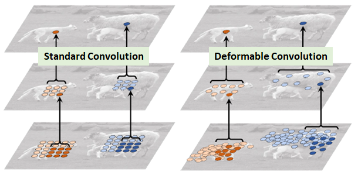

图1  绵羊特征提取

在上面这张图里面，左边传统的卷积显然没有提取到完整绵羊的特征，而右边的可变形卷积则提取到了完整的不规则绵羊的特征。

那可变卷积实际上是怎么做的呢？*其实就是在每一个卷积采样点加上了一个偏移量*，如下图所示：

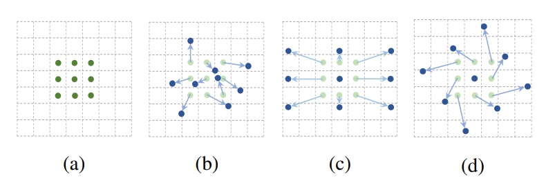

图2  卷积核和可变形卷积核

(a) 所示的正常卷积规律的采样 9 个点(绿点)；(b)(c)(d) 为可变形卷积，在正常的采样坐标上加上一个位移量(蓝色箭头)；其中 (d) 作为 (b) 的特殊情况，展示了可变形卷积可以作为尺度变换，比例变换和旋转变换等特殊情况。

普通的卷积，以$3\times3$卷积为例对于每个输出$y_(\mathrm{p}_0)$，都要从$x$上采样9个位置，这9个位置都在中心位置$\mathrm{x}(p0)$向四周扩散，$(-1,-1)$代表$\mathrm{x}(p0)$的左上角，$(1,1)$代表$\mathrm{x}(p0)$的右下角。

$$
\mathrm{R} = 	\{(-1,-1),(-1,0),...,(0,1),(1,1)\}
$$

所以传统卷积的输出就是（其中$\mathrm{p}_n$就是网格中的$n$个点，$\mathrm{w}(\mathrm{p}_n)$表示对应点位置的卷积权重系数）：
$$
y(\mathrm{p}_0)=\sum_{\mathrm{p}_n\in\mathrm{R}}\mathrm{w}(\mathrm{p}_n) \cdot \mathrm{x}(\mathrm{p}_0+\mathrm{p}_n)
$$

正如上面阐述的可变形卷积，就是在传统的卷积操作上加入了一个偏移量$\Delta \mathrm{p}_n$，正是这个偏移量才让卷积变形为不规则的卷积，这里要注意这个偏移量可以是小数，所以下面的式子的特征值需要通过***双线性插值***的方法来计算。

$$
y(\mathrm{p}_0)=\sum_{\mathrm{p}_n\in\mathrm{R}}\mathrm{w}(\mathrm{p}_n) \cdot \mathrm{x}(\mathrm{p}_0+\mathrm{p}_n+\Delta \mathrm{p}_n)
$$

那这个偏移量如何算呢？我们来看：

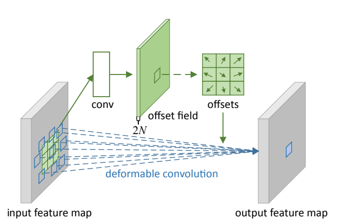

图3  3x3 deformable convolution

对于输入的一张feature map，假设原来的卷积操作是$3\times3$的，那么为了学习偏移量offset，我们定义另外一个$3\times3$的卷积层（图中上面的那层），输出的维度其实就是原来feature map大小，channel数等于$2N$（分别表示$x,y$方向的偏移）。下面的可变形卷积可以看作先基于上面那部分生成的offset做了一个插值操作，然后再执行普通的卷积。

### DCN v2

DCN v2 在DCN v1基础（添加offset）上添加每个采样点的权重

为了解决引入了一些无关区域的问题，在DCN v2中我们不只添加每一个采样点的偏移，还添加了一个权重系数$\Delta m_k$，来区分我们引入的区域是否为我们感兴趣的区域，假如这个采样点的区域我们不感兴趣，则把权重学习为0即可：

$$
y(\mathrm{p}_0)=\sum_{\mathrm{p}_n\in\mathrm{R}}\mathrm{w}(\mathrm{p}_n) \cdot \mathrm{x}(\mathrm{p}_0+\mathrm{p}_n+\Delta \mathrm{p}_n) \cdot \Delta m_k
$$

## **paddle中的API**

`paddle.vision.ops.deform_conv2d(*x*, *offset*, *weight*, *bias=None*, *stride=1*, *padding=0*, *dilation=1*, *deformable_groups=1*, *groups=1*, *mask=None*, *name=None*);`

deform_conv2d 对输入4-D Tensor计算2-D可变形卷积。详情参考[deform_conv2d](https://www.paddlepaddle.org.cn/documentation/docs/zh/api/paddle/vision/ops/deform_conv2d_cn.html#deform-conv2d)。

**核心参数解析：**

- **x** (Tensor) - 形状为 $(N,C,H,W)$的输入Tensor，数据类型为float32或float64。
- **offset** (Tensor) – 可变形卷积层的输入坐标偏移，数据类型为float32或float64。

- **weight** (Tensor) – 卷积核参数，形状为 $M,C/g,k_H,k_W]$, 其中 M 是输出通道数，$g$ 是group组数，$k_H$是卷积核高度尺寸，$k_W$是卷积核宽度尺寸。数据类型为float32或float64。
- **stride** (`int|list|tuple`，可选) - 步长大小。卷积核和输入进行卷积计算时滑动的步长。如果它是一个列表或元组，则必须包含两个整型数：（stride_height,stride_width）。若为一个整数，stride_height = stride_width = stride。默认值：1。
- **padding** (`int|list|tuple`，可选) - 填充大小。卷积核操作填充大小。如果它是一个列表或元组，则必须包含两个整型数：（padding_height,padding_width）。若为一个整数，padding_height = padding_width = padding。默认值：0。
- **mask** (Tensor, 可选) – 可变形卷积层的输入掩码，**当使用可变形卷积算子v1时，请将mask设置为None**, 数据类型为float32或float64。

输入：

- input 形状：$(N,C_{in},H_{in},W_{in})$
- weight形状：$(C_{out},C_{in},H_f,W_f)$
- offset形状：$(N,2*H_f*W_f,H_{out},W_{out})$
- mask形状：$(N,H_f*W_f,H_{out},W_{out})$

输出：

- output形状：$(N,C_{out},H_{out},W_{out})$


其中：

$$
H_{out}=\frac{(H_{in}+2*paddings[0]-(dilations[0]*(H_f-1)+1))}
{strides[0]}+1 \\
W_{out}=\frac{(W_{in}+2*paddings[1]-(dilations[1]*(W_f-1)+1))}
{strides[1]}+1
$$

**算法实例：**

```python
#deformable conv v2:

import paddle
input = paddle.rand((8, 1, 28, 28))
kh, kw = 3, 3
weight = paddle.rand((16, 1, kh, kw))
# offset shape should be [bs, 2 * kh * kw, out_h, out_w]
# mask shape should be [bs, hw * hw, out_h, out_w]
# In this case, for an input of 28, stride of 1
# and kernel size of 3, without padding, the output size is 26
offset = paddle.rand((8, 2 * kh * kw, 26, 26))
mask = paddle.rand((8, kh * kw, 26, 26))
out = paddle.vision.ops.deform_conv2d(input, offset, weight, mask=mask)
print(out.shape)
# returns
[8, 16, 26, 26]

#deformable conv v1: 无mask参数

import paddle
input = paddle.rand((8, 1, 28, 28))
kh, kw = 3, 3
weight = paddle.rand((16, 1, kh, kw))
# offset shape should be [bs, 2 * kh * kw, out_h, out_w]
# In this case, for an input of 28, stride of 1
# and kernel size of 3, without padding, the output size is 26
offset = paddle.rand((8, 2 * kh * kw, 26, 26))
out = paddle.vision.ops.deform_conv2d(input, offset, weight)
print(out.shape)
# returns
[8, 16, 26, 26]

```

***说明：***

- 对于每个input的图片数据都是$(C,H_{in},W_{in})$类型的数据，其中offset和mask（如果有）中的$H_{out}$和$W_{out}$表示的是输出图片的feature数据格式高和宽。
- 对于每个input图片数据数据对应的输出feature map图中每一个输出的特征位置都有对应的一个大小为$2*H_f*W_f$的偏移项和$H_f*W_f$的掩膜项。这样的大小设置是因为偏移项对应的是我们采样的有$H_f*W_f$个点，每个点都有对应的两个偏移方向和一个重要程度。前者就对应了我们的偏移项，后者就对应了掩膜项。
- 算法的过程可以理解为以下三个步骤：
  1. 通过offset获取对应输出位置的偏移数据，进行采样点的偏移
  2. 正常使用卷积核对偏移后的采样点进行卷积操作
  3. 使用mask对卷积的输出进行对应位置相乘 ，这决定了不同位置的关注程度

## 实例效果

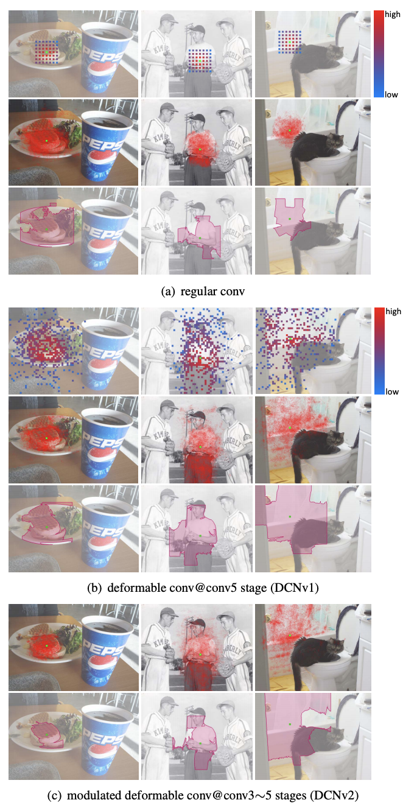

图4  regular、DCN v1、DCN v2的感受野对比

可以从上图4看到，可以看到当绿色点在目标上时，红色点所在区域也集中在目标位置，并且基本能够覆盖不同尺寸的目标，因此经过可变形卷积，我们可以更好地提取出感兴趣物体的完整特征，效果是非常不错的。

但DCN v1听起来不错，但其实也有问题：我们的可变形卷积有可能引入了无用的上下文（区域）来干扰我们的特征提取，这显然会降低算法的表现。通过上图4的对比实验结果（多边形区域框）我们也可以看到DCN v2更能集中在物体的完整有效的区域

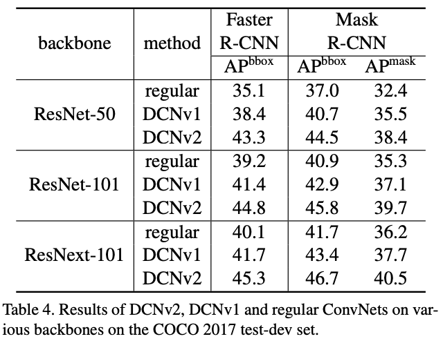

图5  regular、DCN v1、DCN v2的准确率对比

使用可变形卷积，可以更加高效的从图片中获取到目标的特征信息，可以起到提升传统卷积神经网络（如`ResNet`、`Faster R-CNN`等）识别和分割上的性能。如以上图5，可以将`ResNet`等网络中的$3\times3$ 标准卷积操作更改为 $3\times3$ 可变形卷积操作，通过研究发现只要增加很少的计算量，就可以得到较大幅度的性能提升。

总结来说，***DCN v1中引入的offset是要寻找有效信息的区域位置，DCN v2中引入权重系数是要给找到的这个位置赋予权重，这两方面保证了有效信息的准确提取***。

## 参考文献

> [1] Dai J ,  Qi H ,  Xiong Y , et al. Deformable Convolutional Networks[J]. IEEE, 2017.
>
> [2] Zhu X ,  Hu H ,  Lin S , et al. Deformable ConvNets V2: More Deformable, Better Results[C]// 2019 IEEE/CVF Conference on Computer Vision and Pattern Recognition (CVPR). IEEE, 2019.
>
> [3] https://blog.csdn.net/cristiano20/article/details/107931844
>
> [4] https://www.zhihu.com/question/303900394/answer/540818451
>
> [5] https://www.paddlepaddle.org.cn/documentation/docs/zh/api/paddle/vision/ops/deform_conv2d_cn.html